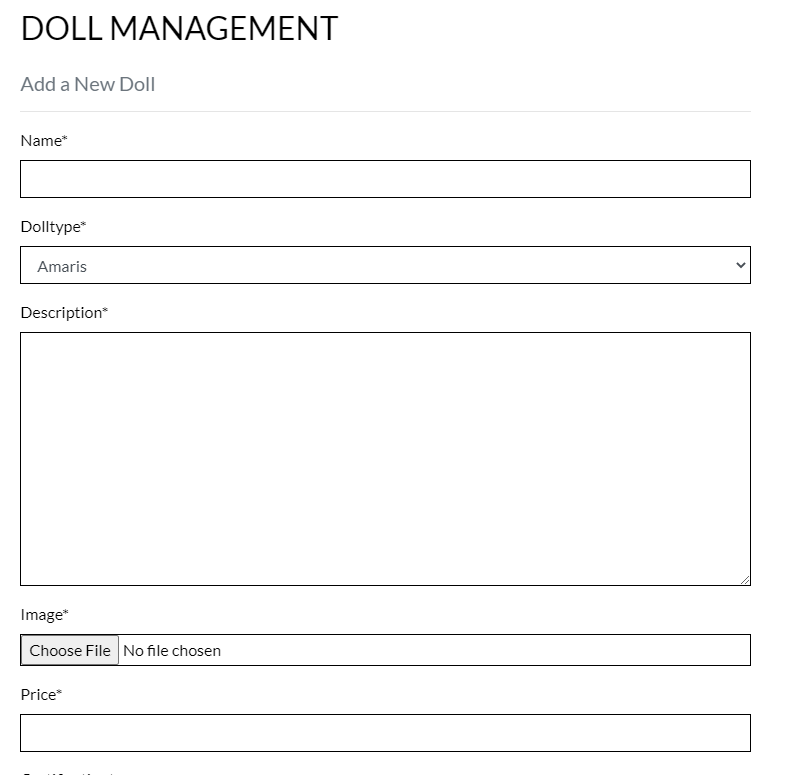
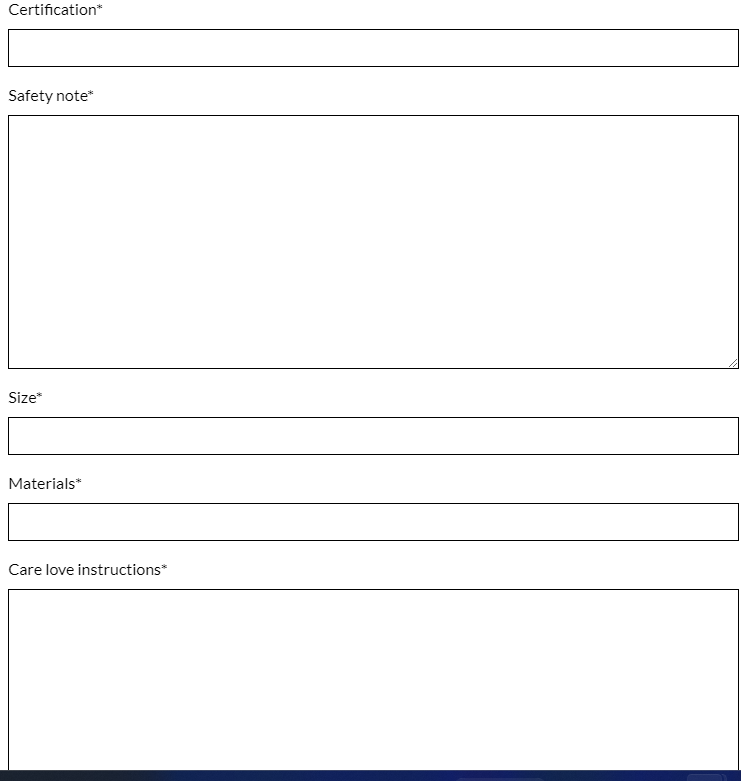
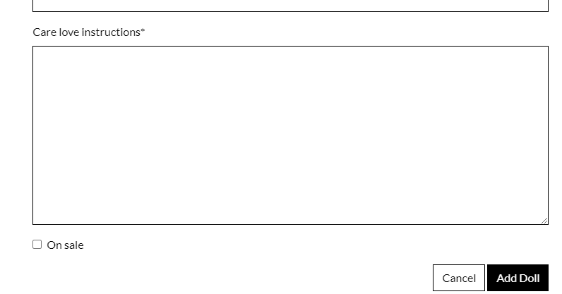
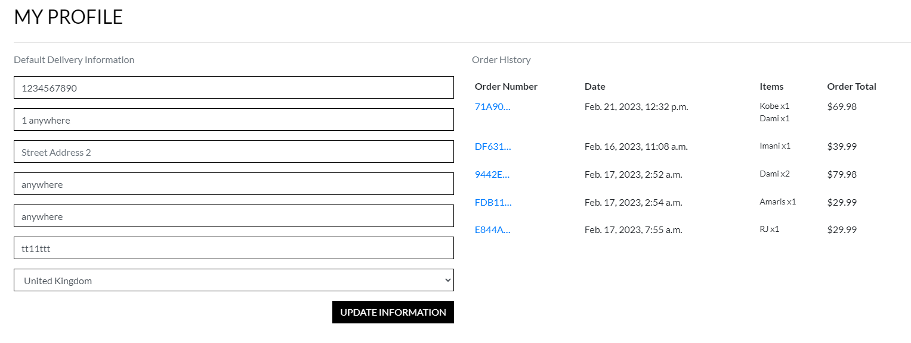
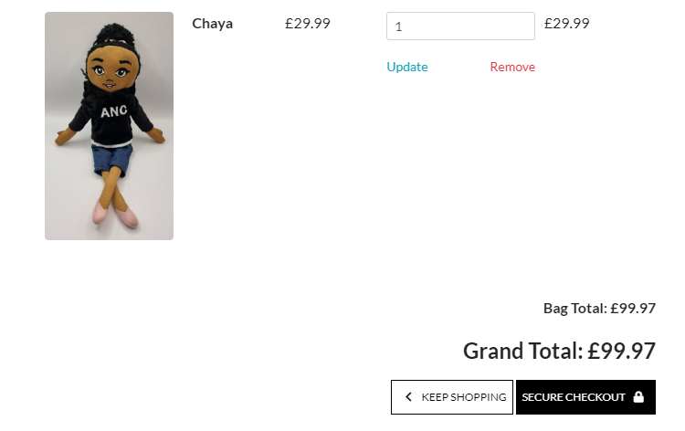
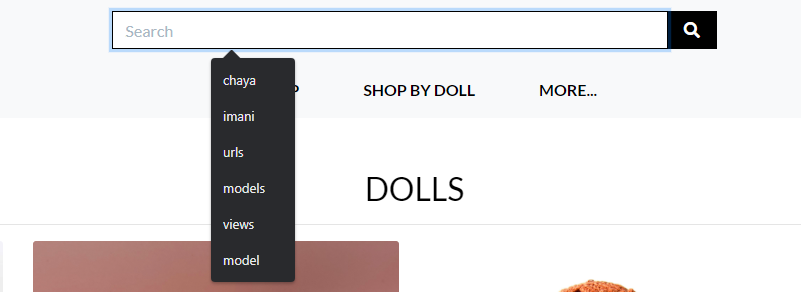

# MLR-SHOP ( Mum Loves Representation - Shop )
MLR-SHOP is an ecommerce store for black, brown, and diverse dolls. It was inspired by my need for my daughter to have a soft doll that represented her.

As a black woman and mother, after unsuccessfully finding a soft black girl doll that reflected her, I began to reflect on the experiences I had growing up as a little black girl. A few of the memories that came back to me, was the lack of representation in the toys/ dolls that I played with, and how that impacted my identity and love of myself growing up.   

I loved playing with dolls, and nothing I had, or was given, looked like me. Consequently, I found myself wanting to look like my white girl dolls instead. I wanted to change who I was and what I looked like, to reflect the dolls that I saw.

I want my little girl and so many others out there to have a soft doll that represents them and how they look. It is easy to get one’s hands-on white dolls, and that fact is just taken for granted.

My mission is to get black, brown, and diverse dolls in the hands of our children and help them explore their imaginations and create stories that include dolls of all colours, so that they know that everyone counts, no matter the shade of their skin.

Dolls and toys, play a big part in shaping a child's childhoods. Even though to us it is just playing, if you really listen to them, you can hear how they view the world, what they think, how they feel and see them shaping and re-imagining the world around them. It is because of this, and my need for my little girl to see herself as beautiful with her melanin rich skin tone, that I made these dolls.

I hope that everyone black, brown or white, that have children, will recognize that your child having and playing with a beloved black doll along with their other dolls, can help them delight in the celebration of others who are also black in real life.

Let us educate our children to celebrate and love our differences.


The Responsive Mockup image above shows how responsive the MLR-SHOP is across various device screen sizes ranging from mobile devices to large monitor screens. The Mum Loves Representation shop is well layed out with a bold font style used across all pages. The buttons are very legible on all the screen sizes. 

## UX

### Colour Scheme Used

I chose to use a black and white colour scheme for the website - Black for the texts, borders, buttons and icons. White for the overly. For the shop now button on the home page, the colours were switched. I used a background image for the home page to give an infusion of some bright colours. Using black and white colour combination helps in adding dramatic areas of contrast since they are very contrasting colours. This contrast helps to direct users attenton to key areas of each web page, to ensure that the maximum amount of information and content is noticed. Black and white don’t generally count as colours, so they serve as great base colours that can be paired well with other colours. They add an understated simplicity to the website making it look as minimalistic as possible.

### Typography

I chose to use the Lato google font for the primary headers and titles and also for the secondary text. The Lato font is well known for its round edges and the approachable warmth it gives to the reader. Its typeface helps deliver information directly. The Lato font works transparently in body text and also stands out individually when used in larger-sized titles. I used font awesome icons through the site for icons such as the lock icon on the secure checkout button and the chevron icon on the keep shopping button. Font awesome icons are very easy to use compared to other alternatives. They allow for flexibility of styling using css since they are treated as actual text. They are compatible with many browsers.

- [Lato](https://fonts.google.com/specimen/Lato) was used for the primary headers and titles and also for the secondary text.

- [Font Awesome](https://fontawesome.com) icons were used throughout the site, such as the lock icon on the secure checkout button and the chevron icon on the keep shopping button.

### User Stories:

- As a Shopper I want to be able to view a list of products so that I can select some to purchase.
- As a shopper I want to be able to view individual product details so that I can identify the price, description and product image
- As a Shopper I want to be able to quickly identify deals, clearance items and special offers so that I can take advantage of special savings on products.
- As a Shopper I want to be able to view my total purchases so that I can monitor my spending.
- As a Site User I want to be able to register an account so that I can have a personal account and be able to view my profile.
- As a Site user I want to be able to login or logout so that I can access my personal account information.
- As a Site user I want to be able to recover my password incase I forget it so that I can regain access to my account.
- As a Site user I want to be able to receive an email confirmation after registration so that I can verify that my account registration was successful.
- As a Site user I want to be able to have a personalized user profile so that I can view my order history, order confirmations and save my payment information.
- As a Shopper I want to be able to sort through list of available products so that I can easily identify the best rated, best priced and categorically sorted products.
- As a Shopper I want to be able to sort a specific category of product so that I can sort the products in that category by name or find the best-priced or best-rated product in a specific category.
- As a Shopper I want to be able to sort multiple categories of products simultaneously so that I can find best-priced or best-rated products across broad categories.
- As a Shopper I want to be able to search for a product by name or description so that I can find a specific product.
- As a shopper I want to be able to easily select the quantity of a specific product I want to purchase so that I can avoid wrong purchases.
- As a Shopper I want to be able to view items in my shopping bag so that I can see the total cost of my purchase.
- As a Shopper I want to be able to edit my shopping bag so that I can make changes to my purchase before checkout.
- As a Shopper I want to be able to easily enter my payment information so that I can checkout quickly.
- As a Shopper I want to be able to feel my personal and payment information is safe and secure so that I can confidently provide the needed information to make a purchase.
- As a Shopper I want to be able to view an order confirmation after checkout so that I can check that I have not made any mistakes.
- As a Shopper I want to be able to receive an email confirmation after checkout so that I can have a record of my purchase.
- As a Store owner I want to be able to add a product so that I can add new items to my store.
- As a Store owner I want to be able to edit and update a product so that I can edit and update various product criteria.
- As a Store owner I want to be able to delete a product so that I can remove items that are no longer for sale.

### Wireframes

Below are sketched images of how I planned to layout the website design. You will notice that the final design of the website is slightly different from my initial sketches for some pages which is because the template i used was not an exact match to my sketches.


## Features 

### Existing Features:

- **The home page**

    - The home page features a nav bar that contains the logo to the far left, a search bar to the center under which the nav links are located, a my account dropdown menu and a shopping bag link to the far right. 
    - The home page features a background image with a hero text  and a shop now button.


- **Logo**

    - The mlr-shop logo is clearly positioned to the top left of the nav bar. It is also a link to the home page.


- **Navigation Bar**

    - The navigation bar contains the logo to the far left, a search bar to the center under which the nav links are located, a my account dropdown menu and a shopping bag link to the far right.


- **Navigation Links**

    - There are three navigation links: 'shop', 'shop by doll' and 'more'. The 'shop' link points to a page that contains all the dolls for sale on the site. The 'shop by doll' link is a drop down menu with a list of all the doll types. The 'more' link is also a drop down menu that contains links to the contact page and newsletter page.


- **My Account link**

    - This link is a drop down menu that contains links to the doll management page, my profile page, and the login/logout/signup pages.


- **Doll Management page**

    - The doll management page is where a super user can add a new doll to the site. It contains all the neccessary fields to assign a new doll to the site. It also contains the on sale field to mark a doll as on sale.





- **My Profile page**

    - My profile page stores the delivery information for a specific user and that user's order history. It also contains a button for the user to update their delivery information.



- **Logout page**

    - The logout page allows a user to logout of his account. 
    - It contains a sign out button for a user to logout.


- **Login page**

    - It contains input fields for user login.
    - It has a sign in button and a home button to return back to the home page without login in.
    - It also contains a remember me checkbox to save the user login details for ease of login.


- **Register page**

    - It contains input fields for signing up, a signup button and a back to login button incase you already have an account.


- **Shopping bag**

    - The shopping bag when empty lets you know with a message saying your bag is empty. It has a keep shopping button to take you back to the shop page.
    - When the shopping bag contains an item, it displays its name, price, quantity and subtotal.
    - The quantity field is an input field allowing you to increase or decrease the quantity.
    - Under it is the update button to update your change and the remove button to remove that item from the shopping bag.
    - At the bottom of the page you have the Grand total, keep shopping button and secure checkout button.
    - The shopping bag link also shows the current value of the shopping bag at anytime.





- **Search bar**

    - The search bar helps the user search for doll any doll across the site. It is clearly postioned at the center of the nav bar.



- **Shop now button**

    - This button takes users to the shop page that shows all the dolls available for sale on the site. On top of it is the hero text that draws users attention to the shop now button.


- **Shop page**

    - This page shows all the dolls available for sale on the site. It has a heading named Dolls.
    - It shows each dolls name and price. Dolls on sale are clearly marked in red font colour. 


- **Doll detail page**

    - When a user clicks on any of the dolls on the shop page, it takes them to the doll detail page which shows all the details about the doll from its price to its description.
    - It also has a quantity input page for selecting the quantity of that particular doll needed. It also has the add to bag button and the keep shopping button.


- **Shop by doll dropdown menu**

    - This dropdown menu shows links to each type of doll available. Once clicked on and a doll is selected, it takes the user to the dolls detail page 


- **Contact link**

    - Details about this particular feature, including the value to the site, and benefit for the user. Be as detailed as possible!


- **Newsletter link**

    - Details about this particular feature, including the value to the site, and benefit for the user. Be as detailed as possible!


- **Checkout page**

    - The checkout page is where the user can enter his personal details such as personal info, delivery address and card details.
    - The left section of the page contains the fields for inputing the details and the right section contains the order summary.
    - Below are the adjust bag button for adjusting the bag and the complete order button to complete the order.


- **Order confirmation page**

    - This page shows the detailed order summary information and also shows that a confirmation email has been sent to the relevant email. It has a continue shopping button at the buttom.


- **Success Messaging**

    - These messages pop up just below the shopping bag to let the user know that the action just performed was successful. 
    - For example when an order goes through and the confirmation page is shown, the success message pops up. 
    - A success message also pops up when a user adds a doll to the shopping bag. In this case the success message also shows the name of the doll, quantity and total. It also gives the user to go straight to the checkout page.
    - A success message pops up when a doll is removed from the shopping bag.


- **Error messaging**

    - Just like the success messaging above you also have the error messaging if an invalid action is performed.


- **Edit page**

    - This page can only be accessed by an authorized user or store owner. It allows the user to edit the details of any doll. It populates all the fields wiht the existing details about the doll allowing the user to change any detail. An update button is situated below to save the changes. A cancel button is also present.


- **Delete button**

    - This allows the user to delete a doll.


### Future Features

- Cool new feature #1
    - Any additional notes about this feature.
- Cool new feature #2
    - Any additional notes about this feature.
- Cool new feature #3
    - Any additional notes about this feature. 

## Tools & Technologies Used

- [HTML](https://en.wikipedia.org/wiki/HTML) used for the main site content.
- [CSS](https://en.wikipedia.org/wiki/CSS) used for the main site design and layout.
- [Bootstrap](https://getbootstrap.com) used as the front-end CSS framework for modern responsiveness and pre-built components.
- [JavaScript](https://www.javascript.com) used for user interaction on the site.
- [Python](https://www.python.org) used as the back-end programming language.
- [Git](https://git-scm.com) used for version control. (`git add`, `git commit`, `git push`)
- [GitHub](https://github.com) used for secure online code storage.
- [Gitpod](https://gitpod.io) used as a cloud-based IDE for development.
- [Markdown Builder by Tim Nelson](https://traveltimn.github.io/readme-builder) used to help generate the Markdown files.
- [Django](https://www.djangoproject.com) used as the Python framework for the site.
- [PostgreSQL](https://www.postgresql.org) used as the relational database management.
- [ElephantSQL](https://www.elephantsql.com) used as the Postgres database.
- [Heroku](https://www.heroku.com) used for hosting the deployed back-end site.
- [Cloudinary](https://cloudinary.com) used for online static file storage.
- [Stripe](https://stripe.com) used for online secure payments of ecommerce products/services.

## Database Schema


## Testing 

- I tested that pagination was working properly on the home page by adding more than four articles to trigger pagination.


- I tested that I could create a new article with the add article page. The new article appeared at the top on the article list area of the home page.


- I tested that I could edit the article I just created with the edit link next to the article.


- I tested to show that I could delete the article I just edited with the delete link next to the edit link.


- I tested that I could register a new account by creating a test-account.


- I tested that the test-account could not edit or delete any other users article. While test-account is logged in, the edit and delete links are not visible next to the articles in the article list area of the home page.


- I tested that the admin user account could edit or delete the article it created. Once logged in, it had access to the edit and delete links on the test article it created.


- I tested that the like button was working and that it showed the number of likes.


- I tested that all social media links were working and opening in new tabs.

### Validator Testing 

- HTML
  - No errors were found when passing through the [Nu Html Checker](https://validator.w3.org/nu/?doc=https://marblog.herokuapp.com/)


  - No errors were found when passing through the [Nu Html Checker](https://validator.w3.org/nu/?doc=https://marblog.herokuapp.com/about/)


  - No errors were found when passing through the [Nu Html Checker](https://validator.w3.org/nu/?doc=https://marblog.herokuapp.com/accounts/signup/)


  - No errors were found when passing through the [Nu Html Checker](https://validator.w3.org/nu/?doc=https://marblog.herokuapp.com/accounts/login/)


  - No errors were found when passing through the [Nu Html Checker](https://validator.w3.org/nu/?doc=https://marblog.herokuapp.com/black-mumprenuer-who-loves-representation/)


- CSS
  - No errors were found when passing through the [W3C CSS Validator](https://validator.w3.org/nu/#textarea)


- Python
  - No errors were found when passing the settings.py file through the CI Python Linter tool [CI Python Linter](https://pep8ci.herokuapp.com/https://raw.githubusercontent.com/onabz/MAR_Blog/main/marblog/settings.py)
  
  

  - No errors were found when passing the urls.py file for the marblog project through the CI Python Linter tool [CI Python Linter](https://pep8ci.herokuapp.com/https://raw.githubusercontent.com/onabz/MAR_Blog/main/marblog/urls.py)

  

  - No errors were found when passing the admin.py file through the CI Python Linter tool [CI Python Linter](https://pep8ci.herokuapp.com/https://raw.githubusercontent.com/onabz/MAR_Blog/main/blog/admin.py)

  

  - No errors were found when passing the forms.py file through the CI Python Linter tool [CI Python Linter](https://pep8ci.herokuapp.com/https://raw.githubusercontent.com/onabz/MAR_Blog/main/blog/forms.py)

  

  - No errors were found when passing the models.py file through the CI Python Linter tool [CI Python Linter](https://pep8ci.herokuapp.com/https://raw.githubusercontent.com/onabz/MAR_Blog/main/blog/models.py)

  

  - No errors were found when passing the urls.py file for the blog app through the CI Python Linter tool [CI Python Linter](https://pep8ci.herokuapp.com/https://raw.githubusercontent.com/onabz/MAR_Blog/main/blog/urls.py)

  

  - No errors were found when passing the views.py file through the CI Python Linter tool [CI Python Linter](https://pep8ci.herokuapp.com/https://raw.githubusercontent.com/onabz/MAR_Blog/main/blog/views.py)

  

### Browser testing
  - Google Chrome

  

  - Firefox

  

  - Opera

  

  - Avg

  

  - Brave

  

  - Microsoft edge

  


### Responsiveness
- Mobile screens

  

- Tablet screens

  

- Small laptops

  

- Large laptops

  

- Extra large screens

  


### User story Testing

- As a User I can view a list of all articles so that I can choose one to read.

  

- As a User I can click on an article so that I can read it in full.

  

- As a User I can like or unlike articles so that I can express my views about them.

  
  

- As a User I can view number of likes on each article so that I can see those that are more popular.

  

- As a User I can leave comments on an article so that I can interact with the content creator.

  

- As a User I can view comments on articles so that I can see the reader's thoughts on the article.

  

- As a User/Admin I can approve or disapprove comments so that I can filter out questionable comments.

  

- As a User I can register an account so that I can like and comment on an article.

  

- As a User/Admin I can create, read, update and delete posts so that I can manage my articles.

  
  
  
  

- As a User/Admin I can draft an article so that I can work on it later.

  

- As a Site User I can add an article from within the website so that I don't have to use the admin panel.

  

- As a Site User I can edit an article from within the website so that I don't have to use the admin panel.

  

- As a Site User I can delete an article from within the website so that I don't have to use the admin panel.

  


## Deployment

The app was deployed to Heroku. There are four stages:
  - Create the Heroku app,
  - Attach the database,
  - Prepare our environment and settings.py file,
  - Get our static and media files stored on Cloudinary.

- Create the Heroku app:
  - In Heroku.com create new Heroku App - APP_NAME, Location = Europe.
  - Add Database to App Resources - Located in the Resources Tab, Add-ons, search and add e.g. 'Heroku Postgres'.
  - Copy DATABASE_URL value - Located in the Settings Tab, click reveal Config Vars, Copy Text.
   
- Attach the Database:
  - In gitpod:
    - Create new env.py file on top level directory - E.g. env.py

  - In env.py:
    - Import os library - import os
    - Set environment variables - os.environ["DATABASE_URL"] = "Paste in Heroku DATABASE_URL Link"
    - Add in secret key - os.environ["SECRET_KEY"] = "Make up your own randomSecretKey"

  - In heroku.com:
    - Add Secret Key to Config Vars - SECRET_KEY, "randomSecretKey"

- Prepare our environment and settings.py file:
    - In settings.py:
      - Reference env.py -  
        ```python                    
        from pathlib import Path
        import os
        import dj_database_url

        if os.path.isfile("env.py"):
          import env
        ```
      - Remove the insecure secret key and replace - links to the SECRET_KEY variable on Heroku - `SECRET_KEY = os.environ.get('SECRET_KEY')`
      - Comment out the old DataBases Section - 
        ```python
        # DATABASES = {
        #     'default': {
        #         'ENGINE': 'django.db.backends.sqlite3',
        #         'NAME': BASE_DIR / 'db.sqlite3',
        #     }
        # }
        ```
      - Add new DATABASES Section ( - links to the DATATBASE_URL variable on Heroku) - 
        ```python
        DATABASES = {
            'default': dj_database_url.parse(os.environ.get("DATABASE_URL"))
        }
        ```
    - In the Terminal:
      - Save all files and Make Migrations - `python3 manage.py migrate`
  
  - Get our static and media files stored on Cloudinary:
    - In Cloudinary.com:
      - Copy your CLOUDINARY_URL e.g. API Environment Variable - From Cloudinary Dashboard
    - In env.py:
     - Add Cloudinary URL to env.py - be sure to paste in the correct section of the link - `os.environ["CLOUDINARY_URL"] = "cloudinary://************************"`
    - In Heroku:
      - Add DISABLE_COLLECTSTATIC to Heroku Config Vars (temporary step for the moment, will be removed before deployment - e.g. `DISABLE_COLLECTSTATIC`, `1`
    - In settings.py:
      - Add Cloudinary Libraries to installed apps - 
        ```python                                            
        INSTALLED_APPS = [
            …,
            'cloudinary_storage',
            'django.contrib.staticfiles',
            'cloudinary',
            …,
        ]
        ```
        (note: order is important)
      - Tell Django to use Cloudinary to store media and static files (Place under the Static files) - 
        ```python
        STATIC_URL = '/static/'

        STATICFILES_STORAGE = 'cloudinary_storage.storage.StaticHashedCloudinaryStorage'
        STATICFILES_DIRS = [os.path.join(BASE_DIR, 'static')]
        STATIC_ROOT = os.path.join(BASE_DIR, 'staticfiles')

        MEDIA_URL = '/media/'
        DEFAULT_FILE_STORAGE = 'cloudinary_storage.storage.MediaCloudinaryStorage'
        ```
      - Link file to the templates directory in Heroku (Place under the BASE_DIR line) - 
        `TEMPLATES_DIR = os.path.join(BASE_DIR, 'templates')`
      - Change the templates directory to TEMPLATES_DIR (Place within the TEMPLATES array) - 
        ```python
        TEMPLATES = [
          {
            …,
            'DIRS': [TEMPLATES_DIR],
            …,
          },
        ]
        ```
      - Add Heroku Hostname to ALLOWED_HOSTS - `ALLOWED_HOSTS = ['marblog.herokuapp.com', 'localhost']`
    - In Gitpod:
      - Create 3 new folders on top level directory - media, static, templates
      - Create procfile on the top level directory - Procfile
    - In Procfile:
      - Add code - `web: gunicorn marblog.wsgi`
    - Note: Save all files
    -  In the Terminal:
      - Add, Commit and Push - 
      ```bash
      git add .
      git commit -m "Deployment Commit"
      git push
      ```
    - In Heroku:
      - Deploy Content manually through heroku.


The live link can be found here - https://marblog.herokuapp.com/

### Local Deployment

To make a local copy of this project, you can clone it by typing the following in your IDE terminal:

- `git clone https://github.com/onabz/MAR_Blog.git`

Alternatively, if using Gitpod, you can click the green Gitpod button, or use [this link](https://gitpod.io/#https://github.com/onabz/MAR_Blog)

## Credits 
 
### Content 

- The steps I used for the project set up was taken from [I think Therefore I Blog](https://www.youtube.com/watch?v=kEdGDvrFSks&ab_channel=MediaUpload)
- The steps I used to apply the bootstrap theme for the blog was from [Using a Bootstrap Theme](https://www.youtube.com/watch?v=tUPjzTHgEWA&t=10s&ab_channel=MediaUpload)
- How I went about creating the update article page was taken from [Update and Edit Blog Post - Django Blog #6](https://www.youtube.com/watch?v=J7xaESAddDQ&list=PLCC34OHNcOtr025c1kHSPrnP18YPB-NFi&index=15&ab_channel=Codemy.com) 
- How I went about creating the delete article page was taken from [Delete a Blog Post - Django Blog #7](https://www.youtube.com/watch?v=8NPOwmtupiI&list=PLCC34OHNcOtr025c1kHSPrnP18YPB-NFi&index=7&ab_channel=Codemy.com)

### Media

- The bootstrap theme used in the design of the blog was from [Start Bootstrap](https://startbootstrap.com/theme/clean-blog)
- The icons in the footer were taken from [Font Awesome](https://fontawesome.com/)
- The template for the login, logout and signup pages was from [Mdbootstrap](https://mdbootstrap.com/docs/standard/extended/login/#section-5)
- All my background images were from [amarisandchaya](https://www.amarisandchaya.com/)
- Most of the articles were from [amarisandchaya](https://www.amarisandchaya.com/) and one from [Metro Parent](https://www.metroparent.com/parenting/talking-about-race/the-importance-of-representation-in-toys/)

### Acknowledgements

- I would like to thank my Mentor Tim Nelson for his invaluable support all through this project. I would not have been able to put all this together if not for his patience and insight.
- I would like to thank [Student Care](https://learn.codeinstitute.net/ci_support/diplomainsoftwaredevelopmentecommerce/studentcare) for their regular check up on me to ensure that I was always on track to completing this project and to reassure me that they were always available if I needed any help.