# MLR-SHOP ( Mum Loves Representation - Shop )
MLR-SHOP is an ecommerce store for black, brown, and diverse dolls. It was inspired by my need for my daughter to have a soft doll that represented her.

As a black woman and mother, after unsuccessfully finding a soft black girl doll that reflected her, I began to reflect on the experiences I had growing up as a little black girl. A few of the memories that came back to me, was the lack of representation in the toys/ dolls that I played with, and how that impacted my identity and love of myself growing up.   

I loved playing with dolls, and nothing I had, or was given, looked like me. Consequently, I found myself wanting to look like my white girl dolls instead. I wanted to change who I was and what I looked like, to reflect the dolls that I saw.

I want my little girl and so many others out there to have a soft doll that represents them and how they look. It is easy to get one’s hands-on white dolls, and that fact is just taken for granted.

My mission is to get black, brown, and diverse dolls in the hands of our children and help them explore their imaginations and create stories that include dolls of all colours, so that they know that everyone counts, no matter the shade of their skin.

Dolls and toys, play a big part in shaping a child's childhoods. Even though to us it is just playing, if you really listen to them, you can hear how they view the world, what they think, how they feel and see them shaping and re-imagining the world around them. It is because of this, and my need for my little girl to see herself as beautiful with her melanin rich skin tone, that I made these dolls.

I hope that everyone black, brown or white, that have children, will recognize that your child having and playing with a beloved black doll along with their other dolls, can help them delight in the celebration of others who are also black in real life.

Let us educate our children to celebrate and love our differences.


The Responsive Mockup image above shows how responsive the MLR-SHOP is across various device screen sizes ranging from mobile devices to large monitor screens. The Mum Loves Representation shop is well layed out with a bold font style used across all pages. The buttons are very legible on all the screen sizes. 

## UX

### Colour Scheme Used

I chose to use a black and white colour scheme for the website - Black for the texts, borders, buttons and icons. White for the overly. For the shop now button on the home page, the colours were switched. I used a background image for the home page to give an infusion of some bright colours. Using black and white colour combination helps in adding dramatic areas of contrast since they are very contrasting colours. This contrast helps to direct users attenton to key areas of each web page, to ensure that the maximum amount of information and content is noticed. Black and white don’t generally count as colours, so they serve as great base colours that can be paired well with other colours. They add an understated simplicity to the website making it look as minimalistic as possible.

### Typography

I chose to use the Lato google font for the primary headers and titles and also for the secondary text. The Lato font is well known for its round edges and the approachable warmth it gives to the reader. Its typeface helps deliver information directly. The Lato font works transparently in body text and also stands out individually when used in larger-sized titles. I used font awesome icons through the site for icons such as the lock icon on the secure checkout button and the chevron icon on the keep shopping button. Font awesome icons are very easy to use compared to other alternatives. They allow for flexibility of styling using css since they are treated as actual text. They are compatible with many browsers.

- [Lato](https://fonts.google.com/specimen/Lato) was used for the primary headers and titles and also for the secondary text.

- [Font Awesome](https://fontawesome.com) icons were used throughout the site, such as the lock icon on the secure checkout button and the chevron icon on the keep shopping button.

### User Stories:

- As a Shopper I want to be able to view a list of products so that I can select some to purchase.
- As a shopper I want to be able to view individual product details so that I can identify the price, description and product image
- As a Shopper I want to be able to quickly identify deals, clearance items and special offers so that I can take advantage of special savings on products.
- As a Shopper I want to be able to view my total purchases so that I can monitor my spending.
- As a Site User I want to be able to register an account so that I can have a personal account and be able to view my profile.
- As a Site user I want to be able to login or logout so that I can access my personal account information.
- As a Site user I want to be able to recover my password incase I forget it so that I can regain access to my account.
- As a Site user I want to be able to receive an email confirmation after registration so that I can verify that my account registration was successful.
- As a Site user I want to be able to have a personalized user profile so that I can view my order history, order confirmations and save my payment information.
- As a Shopper I want to be able to sort through list of available products so that I can easily identify the best rated, best priced and categorically sorted products.
- As a Shopper I want to be able to sort a specific category of product so that I can sort the products in that category by name or find the best-priced or best-rated product in a specific category.
- As a Shopper I want to be able to sort multiple categories of products simultaneously so that I can find best-priced or best-rated products across broad categories.
- As a Shopper I want to be able to search for a product by name or description so that I can find a specific product.
- As a shopper I want to be able to easily select the quantity of a specific product I want to purchase so that I can avoid wrong purchases.
- As a Shopper I want to be able to view items in my shopping bag so that I can see the total cost of my purchase.
- As a Shopper I want to be able to edit my shopping bag so that I can make changes to my purchase before checkout.
- As a Shopper I want to be able to easily enter my payment information so that I can checkout quickly.
- As a Shopper I want to be able to feel my personal and payment information is safe and secure so that I can confidently provide the needed information to make a purchase.
- As a Shopper I want to be able to view an order confirmation after checkout so that I can check that I have not made any mistakes.
- As a Shopper I want to be able to receive an email confirmation after checkout so that I can have a record of my purchase.
- As a Store owner I want to be able to add a product so that I can add new items to my store.
- As a Store owner I want to be able to edit and update a product so that I can edit and update various product criteria.
- As a Store owner I want to be able to delete a product so that I can remove items that are no longer for sale.

### Wireframes

Below are sketched images of how I planned to layout the website design. You will notice that the final design of the website is slightly different from my initial sketches for some pages which is because the template i used was not an exact match to my sketches.

**Home Page Wireframes**


**All Dolls Page Wireframe**


**Doll Detail Page Wireframe**


**Shopping Bag Page Wireframe**


**Checkout Page Wireframe**


**My Profile Page Wireframe**


**Logout Page Wireframe**


**Login Page Wireframe**


**Register Page Wireframe**


**Subscribe To Newsletter Page Wireframe**


**Sendout Newsletter Page Wireframe**


**Add New Doll Page Wireframe**


**Contact Page Wireframe**


## Features 

### Existing Features:

- **The home page**

    - The home page features a nav bar that contains the logo to the far left, a search bar to the center under which the nav links are located, a my account dropdown menu and a shopping bag link to the far right. 
    - The home page features a background image with a hero text  and a shop now button.
    - It also features an affirmation card just below the shop now button that displays random affirmation messages that fit with the ethos of the site.


- **Logo**

    - The mlr-shop logo is clearly positioned to the top left of the nav bar. It is also a link to the home page.


- **Navigation Bar**

    - The navigation bar contains the logo to the far left, a search bar to the center under which the nav links are located, a my account dropdown menu and a shopping bag link to the far right.


- **Navigation Links**

    - There are three navigation links: 'shop', 'shop by doll' and 'more'. The 'shop' link points to a page that contains all the dolls for sale on the site. The 'shop by doll' link is a drop down menu with a list of all the doll types. The 'more' link is also a drop down menu that contains links to the contact page and newsletter page.


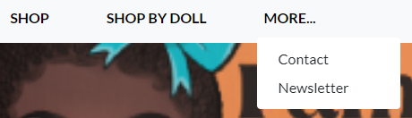

- **My Account link**

    - This link is a drop down menu that contains links to the doll management page, send newsletter, my profile page, and the login/logout/signup pages.


- **Doll Management page**

    - The doll management page is where a super user can add a new doll to the site. It contains all the neccessary fields to assign a new doll to the site. It also contains the on sale field to mark a doll as on sale.


- **Send Newsletter**

    - The send Newsletter page allows the store owner to send newsletters to all subscribers of the site. Only authorised accounts have access to this page.


- **My Profile page**

    - My profile page stores the delivery information for a specific user and that user's order history. It also contains a button for the user to update their delivery information.


- **Logout page**

    - The logout page allows a user to logout of his account. 
    - It contains a sign out button for a user to logout.


- **Login page**

    - It contains input fields for user login.
    - It has a sign in button and a home button to return back to the home page without login in.
    - It also contains a remember me checkbox to save the user login details for ease of login.


- **Register page**

    - It contains input fields for signing up, a signup button and a back to login button incase you already have an account.


- **Passwork reset page**

    - A user who has forgotten his password can reset it by providing his email address. 
    - A password reset link is sent to the user's email address and once the link is clicked on, the user is redirected another password reset page where he can input his new password.
    - The user is then redirected to the login page where the user can login with his new credentials.


- **Affirmation messages**

    - On the home page, with every page refresh, there is a random message from MLR. These are randomly selected from a custom model each time. There are 7 currently.

    - I can do anything I set my mind to.
    - I am an original.
    - What I believe about myself is more important.
    - I am confident in who I am.
    - I can become whatever I want to be.
    - I am capable of amazing things.
    - I start with a positive mindset.


- **Shopping bag**

    - The shopping bag when empty lets you know with a message saying your bag is empty. It has a keep shopping button to take you back to the shop page.
    - When the shopping bag contains an item, it displays its name, price, quantity and subtotal.
    - The quantity field is an input field allowing you to increase or decrease the quantity.
    - Under it is the update button to update your change and the remove button to remove that item from the shopping bag.
    - At the bottom of the page you have the Grand total, keep shopping button and secure checkout button.
    - The shopping bag link also shows the current value of the shopping bag at anytime.


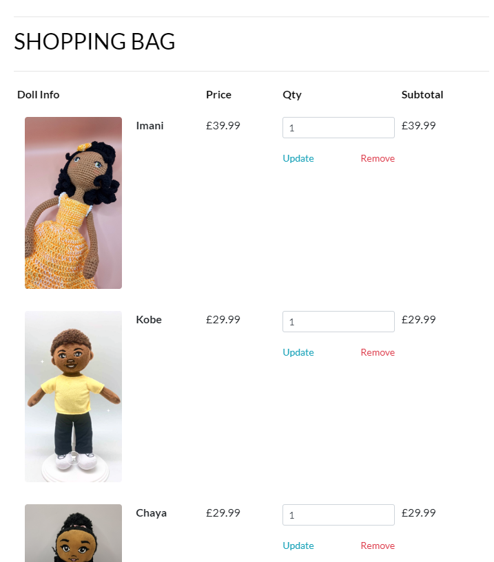


- **Search bar**

    - The search bar helps the user search for doll any doll across the site. It is clearly postioned at the center of the nav bar.


- **Shop now button**

    - This button takes users to the shop page that shows all the dolls available for sale on the site. On top of it is the hero text that draws users attention to the shop now button.


- **Footer**

    - The footer is located at the very bottom of every page on the site. It houses the social media icons, making them readily available on all pages. 


- **Social media icons**

    - These icons are located within the footer. When clicked on, they open in new tabs so as not to disrupt the current page the user is on. They include the slack icon, linkedin icon and the github icon.


- **Shop page**

    - This page shows all the dolls available for sale on the site. It has a heading named Dolls.
    - It shows each dolls name and price. Dolls on sale are clearly marked in red font colour. 


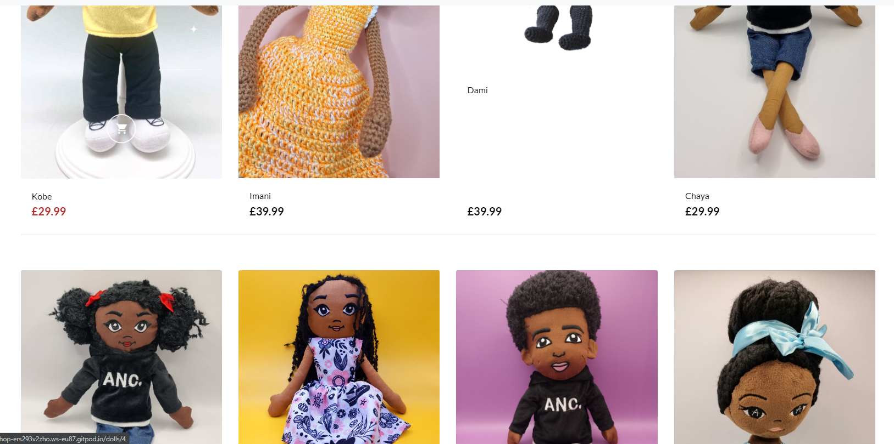

- **Doll detail page**

    - When a user clicks on any of the dolls on the shop page, it takes them to the doll detail page which shows all the details about the doll from its price to its description.
    - It also has a quantity input page for selecting the quantity of that particular doll needed. It also has the add to bag button and the keep shopping button.

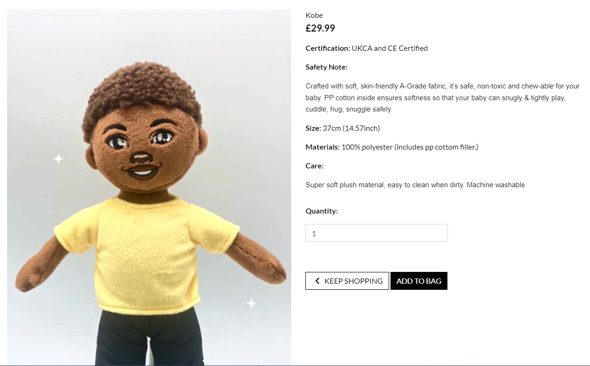


- **Doll on sale**

    - The on sale tag can be applied to any doll on sale. Once applied, the price colour changes to red with a tag logo appearing infront also in red to help clearly mark the doll as being on sale. 

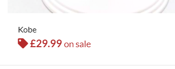

- **Shop by doll dropdown menu**

    - This dropdown menu shows links to each type of doll available. Once clicked on and a doll is selected, it takes the user to the dolls detail page. 


- **Contact link**

    - This is essentially the contact page were customers can contact the store owner about anything.


- **Newsletter link**

    - This page allows customers to subcribe for regular newsletters from the site about important information such as new deals, sales and so on.


- **Checkout page**

    - The checkout page is where the user can enter his personal details such as personal info, delivery address and card details.
    - The left section of the page contains the fields for inputing the details and the right section contains the order summary.
    - Below are the adjust bag button for adjusting the bag and the complete order button to complete the order.


- **Order confirmation page**

    - This page shows the detailed order summary information and also shows that a confirmation email has been sent to the relevant email. It has a continue shopping button at the buttom.


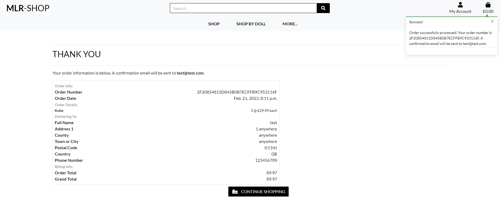

- **Success Messaging**

    - These messages pop up just below the shopping bag to let the user know that the action just performed was successful. 
    - For example when an order goes through and the confirmation page is shown, the success message pops up. 
    - A success message also pops up when a user adds a doll to the shopping bag. In this case the success message also shows the name of the doll, quantity and total. It also gives the user to go straight to the checkout page.
    - A success message pops up when a doll is removed from the shopping bag.


- **Error messaging**

    - Just like the success messaging above you also have the error messaging if an invalid action is performed.


- **Edit page**

    - This page can only be accessed by an authorized user or store owner. It allows the user to edit the details of any doll. It populates all the fields wiht the existing details about the doll allowing the user to change any detail. An update button is situated below to save the changes. A cancel button is also present.

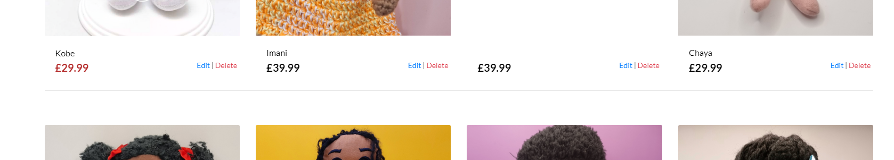
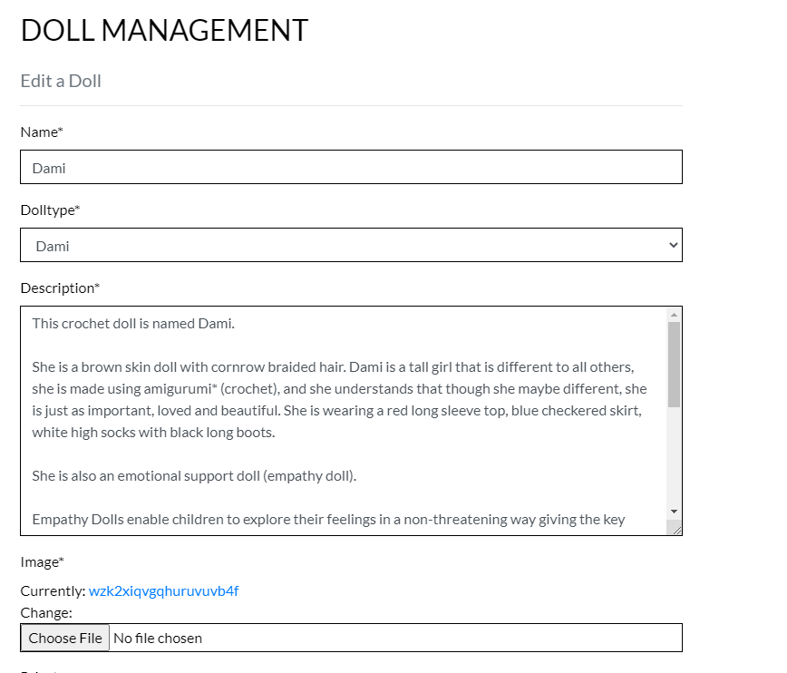
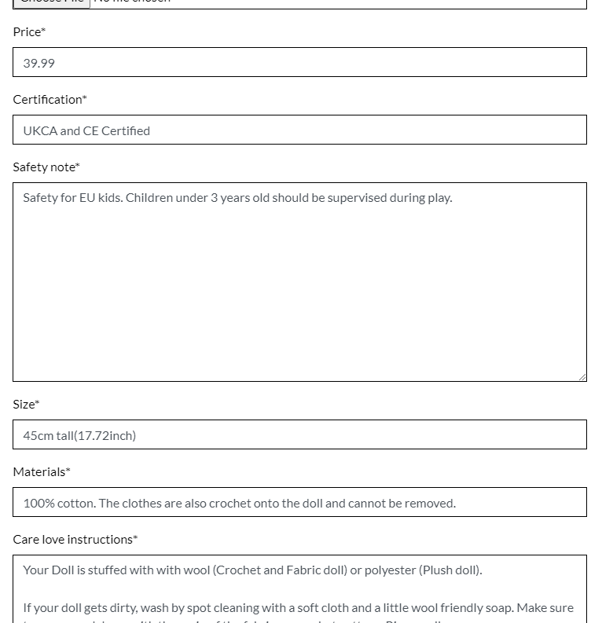
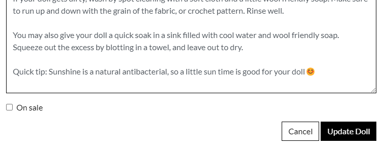

- **Delete button**

    - This allows the user to delete a doll.

- **404 Page**

    - Page Not Found.


- **500 Page**

    - Internal Server Error.


- **Admin Page**

    - This is the admin page where the admin user can manage the site from the backend.


### Future Features

- Categories
    - I would like to implement a more robust category grouping of a larger range of diverse products on the site.
- Filtering and sorting
    - I would like to implement a proper filtering and sorting system to enable users be more specific in searchng for products.
- Review section
    - I would like to include a review section to enable customers to give important feed back on the products on the site. 
- My Profile
    - I would like to add a name field and email field to this page to further personalize it.
- Confirmation message before delete 
    - I would like to add a confirmation message to appear when a super user clicks on the delete link so that user can be sure before deleting any doll.

## Tools & Technologies Used

- [HTML](https://en.wikipedia.org/wiki/HTML) used for the main site content.
- [CSS](https://en.wikipedia.org/wiki/CSS) used for the main site design and layout.
- [Bootstrap](https://getbootstrap.com) used as the front-end CSS framework for modern responsiveness and pre-built components.
- [JavaScript](https://www.javascript.com) used for user interaction on the site.
- [Python](https://www.python.org) used as the back-end programming language.
- [Git](https://git-scm.com) used for version control. (`git add`, `git commit`, `git push`)
- [GitHub](https://github.com) used for secure online code storage.
- [Gitpod](https://gitpod.io) used as a cloud-based IDE for development.
- [Markdown Builder by Tim Nelson](https://traveltimn.github.io/readme-builder) used to help generate the Markdown files.
- [Django](https://www.djangoproject.com) used as the Python framework for the site.
- [PostgreSQL](https://www.postgresql.org) used as the relational database management.
- [ElephantSQL](https://www.elephantsql.com) used as the Postgres database.
- [Heroku](https://www.heroku.com) used for hosting the deployed back-end site.
- [Cloudinary](https://cloudinary.com) used for online static file storage.
- [Stripe](https://stripe.com) used for online secure payments of ecommerce products/services.

## Database Schema


## Agile Development Process

### GitHub Projects

[GitHub Projects](https://github.com/onabz/mlr-shop/projects) served as an Agile tool for this project.
It isn't a specialized tool, but with the right tags and project creation/issue assignments, it can be made to work.

Through it, user stories, issues, and milestone tasks were planned, then tracked on a weekly basis using the basic Kanban board.


### GitHub Issues

[GitHub Issues](https://github.com/onabz/mlr-shop/issues) served as another Agile tool.
There, I used my own **User Story Template** to manage user stories.

It also helped with milestone iterations on a weekly basis.

- [Open Issues](https://github.com/onabz/mlr-shop/issues)

    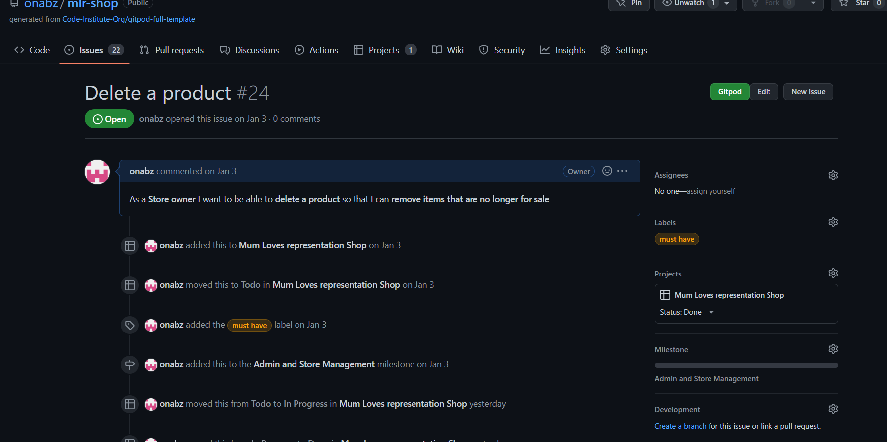

- [Closed Issues](https://github.com/onabz/mlr-shop/issues?q=is%3Aissue+is%3Aclosed)

    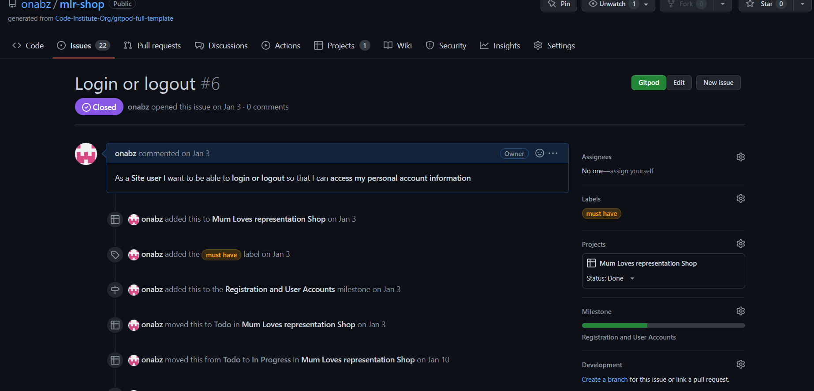

### MoSCoW Prioritization

I've decomposed my Epics into stories prior to prioritizing and implementing them.
Using this approach, I was able to apply the MoSCow prioritization and labels to my user stories within the Issues tab.

- **Must Have**: guaranteed to be delivered (*max 80% of stories*)
- **Should Have**: adds significant value, but not vital (*the rest ~10% of stories*)
- **Could Have**: has small impact if left out (*5% of stories*)
- **Won't Have**: not a priority for this iteration

## Ecommerce Business Model

This site sells goods to individual customers, and therefore follows a `Business to Customer` model.
It is of the simplest **B2C** forms, as it focuses on individual transactions, and doesn't need anything
such as monthly/annual subscriptions.

It is still in its early development stages, although it already has a newsletter, and links for social media marketing.

Social media can potentially build a community of users around the business, and boost site visitor numbers, especially when using larger platforms such a Facebook.

A newsletter list can be used by the business to send regular messages to site users.
For example, what items are on special offer, new items in stock,
updates to business hours, notifications of events, and much more!

## Search Engine Optimization (SEO) & Social Media Marketing

### Keywords

I've identified some appropriate keywords to align with my site, that should help users
when searching online to find my page easily from a search engine.
This included a series of the following keyword types

- Short-tail (head terms) keywords
- Long-tail keywords

I also played around with [Word Tracker](https://www.wordtracker.com) a bit
to check the frequency of some of my site's primary keywords (only until the free trial expired).

### Sitemap

I've used [XML-Sitemaps](https://www.xml-sitemaps.com) to generate a sitemap.xml file.
This was generated using my deployed site URL: https://mlr-shop.herokuapp.com

After it finished crawling the entire site, it created a
[sitemap.xml](sitemap.xml) which I've downloaded and included in the repository.

### Robots

I've created the [robots.txt](robots.txt) file at the root-level.
Inside, I've included the default settings:

```
User-agent: *
Disallow:
Sitemap: https://mlr-shop.herokuapp.com/sitemap.xml
```

Further links for future implementation:
- [Google search console](https://search.google.com/search-console)
- [Creating and submitting a sitemap](https://developers.google.com/search/docs/advanced/sitemaps/build-sitemap)
- [Managing your sitemaps and using sitemaps reports](https://support.google.com/webmasters/answer/7451001)
- [Testing the robots.txt file](https://support.google.com/webmasters/answer/6062598)

### Social Media Marketing

Creating a strong social base (with participation) and linking that to the business site can help drive sales.
Using more popular providers with a wider user base, such as Facebook, typically maximizes site views.

Below is a link to a live Facebook business page with the same ethos as this site.

[Facebook Business page](https://www.facebook.com/profile.php?id=100068065985462)

I've created a mockup Facebook business account using the
[Balsamiq template](https://code-institute-org.github.io/5P-Assessments-Handbook/files/Facebook_Mockups.zip)
provided by Code Institute.


### Newsletter Marketing

I have incorporated a newsletter sign-up form on my application, to allow users to supply their
email address if they are interested in learning more. 

[Newsletter Signup Page](documentation/testing/5-newsletter-subscribe.png)

## Testing 

To view all testing, please refer to the [TESTING.md](TESTING.md) file.

## Deployment

The live deployed application can be found deployed on [Heroku](https://mlr-shop.herokuapp.com).

### ElephantSQL Database

This project uses [ElephantSQL](https://www.elephantsql.com) for the PostgreSQL Database.

To obtain your own Postgres Database, sign-up with your GitHub account, then follow these steps:
- Click **Create New Instance** to start a new database.
- Provide a name (this is commonly the name of the project: mlr-shop).
- Select the **Tiny Turtle (Free)** plan.
- You can leave the **Tags** blank.
- Select the **Region** and **Data Center** closest to you.
- Once created, click on the new database name, where you can view the database URL and Password.

### Stripe API

This project uses [Stripe](https://stripe.com) to handle the ecommerce payments.

Once you've created a Stripe account and logged-in, follow these series of steps to get your project connected.

- From your Stripe dashboard, click to expand the "Get your test API keys".
- You'll have two keys here:
	- `STRIPE_PUBLIC_KEY` = Publishable Key (starts with **pk**)
	- `STRIPE_SECRET_KEY` = Secret Key (starts with **sk**)

As a backup, in case users prematurely close the purchase-order page during payment, we can include Stripe Webhooks.

- From your Stripe dashboard, click **Developers**, and select **Webhooks**.
- From there, click **Add Endpoint**.
	- `https://mlr-shop.herokuapp.com/checkout/wh/`
- Click **receive all events**.
- Click **Add Endpoint** to complete the process.
- You'll have a new key here:
	- `STRIPE_WH_SECRET` = Signing Secret (Wehbook) Key (starts with **wh**)

### Gmail API

This project uses [Gmail](https://mail.google.com) to handle sending emails to users for account verification and purchase order confirmations.

Once you've created a Gmail (Google) account and logged-in, follow these series of steps to get your project connected.

- Click on the **Account Settings** (cog icon) in the top-right corner of Gmail.
- Click on the **Accounts and Import** tab.
- Within the section called "Change account settings", click on the link for **Other Google Account settings**.
- From this new page, select **Security** on the left.
- Select **2-Step Verification** to turn it on. (verify your password and account)
- Once verified, select **Turn On** for 2FA.
- Navigate back to the **Security** page, and you'll see a new option called **App passwords**.
- This might prompt you once again to confirm your password and account.
- Select **Mail** for the app type.
- Select **Other (Custom name)** for the device type.
	- Any custom name, such as "Django" or mlr-shop
- You'll be provided with a 16-character password (API key).
	- Save this somewhere locally, as you cannot access this key again later!
	- `EMAIL_HOST_PASS` = your new 16-character API key
	- `EMAIL_HOST_USER` = your own personal Gmail email address (`you@gmail.com`)

### Heroku Deployment

This project uses [Heroku](https://www.heroku.com), a platform as a service (PaaS) that enables developers to build, run, and operate applications entirely in the cloud.

Deployment steps are as follows, after account setup:

- Select **New** in the top-right corner of your Heroku Dashboard, and select **Create new app** from the dropdown menu.
- Your app name must be unique, and then choose a region closest to you (EU or USA), and finally, select **Create App**.
- From the new app **Settings**, click **Reveal Config Vars**, and set your environment variables.

| Key | Value |
| --- | --- |
| `CLOUDINARY_URL` | "insert-your-own" |
| `DATABASE_URL` | "insert-your-own" |
| `DISABLE_COLLECTSTATIC` | 1 (*this is temporary, and can be removed for the final deployment*) |
| `EMAIL_HOST_PASS` | "insert-your-own" |
| `EMAIL_HOST_USER` | "insert-your-own" |
| `SECRET_KEY` | "insert-your-own" |
| `STRIPE_PUBLIC_KEY` | "insert-your-own" |
| `STRIPE_SECRET_KEY` | "insert-your-own" |
| `STRIPE_WH_SECRET` | "insert-your-own" |

Heroku needs two additional files in order to deploy properly.
- requirements.txt
- Procfile

You can install this project's **requirements** (where applicable) using:
- `pip3 install -r requirements.txt`

If you have your own packages that have been installed, then the requirements file needs updated using:
- `pip3 freeze --local > requirements.txt`

The **Procfile** can be created with the following command:
- `echo web: gunicorn app_name.wsgi > Procfile`
- *replace **app_name** with the name of your primary Django app name; the folder where settings.py is located*

For Heroku deployment, follow these steps to connect your own GitHub repository to the newly created app:

Either:
- Select **Automatic Deployment** from the Heroku app.

Or:
- In the Terminal/CLI, connect to Heroku using this command: `heroku login -i`
- Set the remote for Heroku: `heroku git:remote -a app_name` (replace *app_name* with your app name)
- After performing the standard Git `add`, `commit`, and `push` to GitHub, you can now type:
	- `git push heroku main`

The project should now be connected and deployed to Heroku!

### Local Deployment

This project can be cloned or forked in order to make a local copy on your own system.

For either method, you will need to install any applicable packages found within the *requirements.txt* file.
- `pip3 install -r requirements.txt`.

You will need to create a new file called `env.py` at the root-level,
and include the same environment variables listed above from the Heroku deployment steps.

Sample `env.py` file:

```python
import os

os.environ.setdefault("CLOUDINARY_URL", "insert-your-own")
os.environ.setdefault("DATABASE_URL", "insert-your-own")
os.environ.setdefault("EMAIL_HOST_PASS", "insert-your-own")
os.environ.setdefault("EMAIL_HOST_USER", "insert-your-own")
os.environ.setdefault("SECRET_KEY", "insert-your-own")
os.environ.setdefault("STRIPE_PUBLIC_KEY", "insert-your-own")
os.environ.setdefault("STRIPE_SECRET_KEY", "insert-your-own")
os.environ.setdefault("STRIPE_WH_SECRET", "insert-your-own")

# local environment only (do not include these in production/deployment!)
os.environ.setdefault("DEBUG", "True")
```

Once the project is cloned or forked, in order to run it locally, you'll need to follow these steps:
- Start the Django app: `python3 manage.py runserver`
- Stop the app once it's loaded: `CTRL+C` or `⌘+C` (Mac)
- Make any necessary migrations: `python3 manage.py makemigrations`
- Migrate the data to the database: `python3 manage.py migrate`
- Create a superuser: `python3 manage.py createsuperuser`
- Load fixtures (if applicable): `python3 manage.py loaddata file-name.json` (repeat for each file)
- Everything should be ready now, so run the Django app again: `python3 manage.py runserver`

If you'd like to backup your database models, use the following command for each model you'd like to create a fixture for:
- `python3 manage.py dumpdata your-model > your-model.json`
- *repeat this action for each model you wish to backup*

#### Cloning

You can clone the repository by following these steps:

1. Go to the [GitHub repository](https://github.com/onabz/mlr-shop) 
2. Locate the Code button above the list of files and click it 
3. Select if you prefer to clone using HTTPS, SSH, or GitHub CLI and click the copy button to copy the URL to your clipboard
4. Open Git Bash or Terminal
5. Change the current working directory to the one where you want the cloned directory
6. In your IDE Terminal, type the following command to clone my repository:
	- `git clone https://github.com/onabz/mlr-shop.git`
7. Press Enter to create your local clone.

Alternatively, if using Gitpod, you can click below to create your own workspace using this repository.

[](https://gitpod.io/#https://github.com/onabz/mlr-shop)

Please note that in order to directly open the project in Gitpod, you need to have the browser extension installed.
A tutorial on how to do that can be found [here](https://www.gitpod.io/docs/configure/user-settings/browser-extension).

#### Forking

By forking the GitHub Repository, we make a copy of the original repository on our GitHub account to view and/or make changes without affecting the original owner's repository.
You can fork this repository by using the following steps:

1. Log in to GitHub and locate the [GitHub Repository](https://github.com/onabz/mlr-shop)
2. At the top of the Repository (not top of page) just above the "Settings" Button on the menu, locate the "Fork" Button.
3. Once clicked, you should now have a copy of the original repository in your own GitHub account!

### Local VS Deployment

There are currently no differences between the local site and the development site.

## Credits 
 
### Content 

- The steps I used for the project set up was taken from [I think Therefore I Blog](https://www.youtube.com/watch?v=kEdGDvrFSks&ab_channel=MediaUpload) and also [Boutique Ado](https://www.youtube.com/watch?v=EsJtBpLgLCw&ab_channel=MediaUpload)
- The steps I used to setup the newsletter was taken from [Build a Newsletter Section for Your Django Web Application](https://www.youtube.com/watch?v=hWtlskOaFNI&ab_channel=KenBroTech)
- Some of he steps I used in setting up the contact form were taken from [Create Contact Form in Django for any website || Contact Form with bootstrap in django](https://www.youtube.com/watch?v=lSgRWA4PMt4&t=42s&ab_channel=BLearningClub)

### Media

- The design idea for the website was taken from [Boutique Ado](https://www.youtube.com/watch?v=3gQazh-EIzY&t=20s&ab_channel=MediaUpload)
- The icons used through out  the site were taken from [Font Awesome](https://fontawesome.com/)
- All my background images were from [amarisandchaya](https://www.amarisandchaya.com/)
- All my doll images were from [amarisandchaya](https://www.amarisandchaya.com/)

### Acknowledgements

- I would like to thank my Mentor [Tim Nelson](https://github.com/TravelTimN) for his invaluable support all through this project. I would not have been able to put all this together if not for his patience and insight.
- I would like to thank [Student Care](https://learn.codeinstitute.net/ci_support/diplomainsoftwaredevelopmentecommerce/studentcare) for their regular check up on me to ensure that I was always on track to completing this project and to reassure me that they were always available if I needed any help.
- I would like to thank the good people of [Tutor support](https://learn.codeinstitute.net/ci_support/diplomainsoftwaredevelopmentecommerce/tutor) for always being very polite and patient with me in resolving issues that I raised with them while working on this project. 