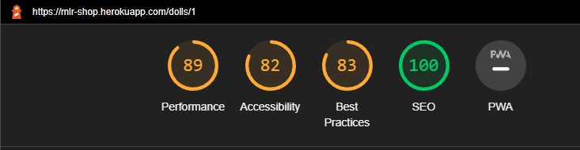
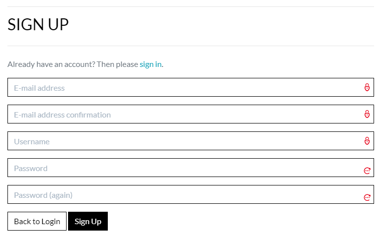

# Testing

Return back to the [README.md](README.md) file.

## Code Validation

### HTML

I have used the recommended [HTML W3C Validator](https://validator.w3.org) to validate all of my HTML files.

| Page | W3C URL | Screenshot | Notes |
| --- | --- | --- | --- |
| home | [W3C Validation](https://validator.w3.org/nu/?doc=https://mlr-shop.herokuapp.com/) |  | Section lacks heading |
| signup | [W3C Validation](https://validator.w3.org/nu/?doc=https://mlr-shop.herokuapp.com/accounts/signup/) |  | Section lacks heading |
| login | [W3C Validation](https://validator.w3.org/nu/?doc=https://mlr-shop.herokuapp.com/accounts/login/) |  | Section lacks heading |
| bag | [W3C Validation](https://validator.w3.org/nu/?doc=https://mlr-shop.herokuapp.com/bag/) |  | Section lacks heading |
| dolls | [W3C Validation](https://validator.w3.org/nu/?doc=https://mlr-shop.herokuapp.com/dolls/) |  | Section lacks heading |
| dolls (by type) | [W3C Validation](https://validator.w3.org/nu/?doc=https://mlr-shop.herokuapp.com/dolls/?dolltype=amaris) |  | Section lacks heading |
| contact | [W3C Validation](https://validator.w3.org/nu/?doc=https://mlr-shop.herokuapp.com/contact/) |  | Section lacks heading |
| newsletter | [W3C Validation](https://validator.w3.org/nu/?doc=https://mlr-shop.herokuapp.com/newsletter/) |  | Section lacks heading |
| password reset | [W3C Validation](https://validator.w3.org/nu/?doc=https://mlr-shop.herokuapp.com/accounts/password/reset/) |  | Section lacks heading. Trailing slash on void elements. |
| doll details | [W3C Validation](https://validator.w3.org/nu/?doc=https://mlr-shop.herokuapp.com/dolls/1) |  | Section lacks heading |

### CSS

I have used the recommended [CSS Jigsaw Validator](https://jigsaw.w3.org/css-validator) to validate all of my CSS files.

| App | File | Jigsaw URL | Screenshot | Notes |
| --- | --- | --- | --- | --- |
| static | [base.css](static/css/base.css) | [Jigsaw Validation](https://jigsaw.w3.org/css-validator/validator?uri=https%3A%2F%2Fmlr-shop.herokuapp.com) |  | 712 warnings from third-party code |
| profiles | [profile.css](profiles/static/profiles/css/profile.css) | N/A |  | |
| checkout | [checkout.css](checkout/static/checkout/css/checkout.css) | N/A |  | 1 warning |

### JavaScript

I have used the recommended [JShint Validator](https://jshint.com) to validate all of my JS files.

| App | File | Screenshot | Notes |
| --- | --- | --- | --- |
| checkout | [stripe_elements.js](checkout/static/checkout/js/stripe_elements.js) |  | Undefined Stripe variable |
| profiles | [countryfield.js](profiles/static/profiles/js/countryfield.js) |  | |

### Python

I have used the recommended [CI Python Linter](https://pep8ci.herokuapp.com) to validate all of my Python files.

| App | File | Validation Link |
| --- | --- | --- |
| bag | | |
| | [bag_tools.py](bag/templatetags/bag_tools.py) | [CI PEP8 Validator](https://pep8ci.herokuapp.com/https://raw.githubusercontent.com/onabz/mlr-shop/main/bag/templatetags/bag_tools.py) |
| | [contexts.py](bag/contexts.py) | [CI PEP8 Validator](https://pep8ci.herokuapp.com/https://raw.githubusercontent.com/onabz/mlr-shop/main/bag/contexts.py) |
| | [urls.py](bag/urls.py) | [CI PEP8 Validator](https://pep8ci.herokuapp.com/https://raw.githubusercontent.com/onabz/mlr-shop/main/bag/urls.py) |
| | [views.py](bag/views.py) | [CI PEP8 Validator](https://pep8ci.herokuapp.com/https://raw.githubusercontent.com/onabz/mlr-shop/main/bag/views.py) |
| checkout |  | |
| | [apps.py](checkout/apps.py) | [CI PEP8 Validator](https://pep8ci.herokuapp.com/https://raw.githubusercontent.com/onabz/mlr-shop/main/checkout/apps.py) |
| | [forms.py](checkout/forms.py) | [CI PEP8 Validator](https://pep8ci.herokuapp.com/https://raw.githubusercontent.com/onabz/mlr-shop/main/checkout/forms.py) |
| | [models.py](checkout/models.py) | [CI PEP8 Validator](https://pep8ci.herokuapp.com/https://raw.githubusercontent.com/onabz/mlr-shop/main/checkout/models.py) |
| | [signals.py](checkout/signals.py) | [CI PEP8 Validator](https://pep8ci.herokuapp.com/https://raw.githubusercontent.com/onabz/mlr-shop/main/checkout/signals.py) |
| | [urls.py](checkout/urls.py) | [CI PEP8 Validator](https://pep8ci.herokuapp.com/https://raw.githubusercontent.com/onabz/mlr-shop/main/checkout/urls.py) |
| | [views.py](checkout/views.py) | [CI PEP8 Validator](https://pep8ci.herokuapp.com/https://raw.githubusercontent.com/onabz/mlr-shop/main/checkout/views.py) |
| | [webhook_handler.py](checkout/webhook_handler.py) | [CI PEP8 Validator](https://pep8ci.herokuapp.com/https://raw.githubusercontent.com/onabz/mlr-shop/main/checkout/webhook_handler.py) |
| | [webhooks.py](checkout/webhooks.py) | [CI PEP8 Validator](https://pep8ci.herokuapp.com/https://raw.githubusercontent.com/onabz/mlr-shop/main/checkout/webhooks.py) |
| contact | | |
| | [admin.py](contact/admin.py) | [CI PEP8 Validator](https://pep8ci.herokuapp.com/https://raw.githubusercontent.com/onabz/mlr-shop/main/contact/admin.py) |
| | [forms.py](contact/forms.py) | [CI PEP8 Validator](https://pep8ci.herokuapp.com/https://raw.githubusercontent.com/onabz/mlr-shop/main/contact/forms.py) |
| | [models.py](contact/models.py) | [CI PEP8 Validator](https://pep8ci.herokuapp.com/https://raw.githubusercontent.com/onabz/mlr-shop/main/contact/models.py) |
| | [urls.py](contact/urls.py) | [CI PEP8 Validator](https://pep8ci.herokuapp.com/https://raw.githubusercontent.com/onabz/mlr-shop/main/contact/urls.py) |
| | [views.py](contact/views.py) | [CI PEP8 Validator](https://pep8ci.herokuapp.com/https://raw.githubusercontent.com/onabz/mlr-shop/main/contact/views.py) |
| dolls | | |
| | [admin.py](dolls/admin.py) | [CI PEP8 Validator](https://pep8ci.herokuapp.com/https://raw.githubusercontent.com/onabz/mlr-shop/main/dolls/admin.py) |
| | [forms.py](dolls/forms.py) | [CI PEP8 Validator](https://pep8ci.herokuapp.com/https://raw.githubusercontent.com/onabz/mlr-shop/main/dolls/forms.py) |
| | [models.py](dolls/models.py) | [CI PEP8 Validator](https://pep8ci.herokuapp.com/https://raw.githubusercontent.com/onabz/mlr-shop/main/dolls/models.py) |
| | [urls.py](dolls/urls.py) | [CI PEP8 Validator](https://pep8ci.herokuapp.com/https://raw.githubusercontent.com/onabz/mlr-shop/main/dolls/urls.py) |
| | [views.py](dolls/views.py) | [CI PEP8 Validator](https://pep8ci.herokuapp.com/https://raw.githubusercontent.com/onabz/mlr-shop/main/dolls/views.py) |
| home | | |
| | [models.py](home/models.py) | [CI PEP8 Validator](https://pep8ci.herokuapp.com/https://raw.githubusercontent.com/onabz/mlr-shop/main/home/models.py) |
| | [urls.py](home/urls.py) | [CI PEP8 Validator](https://pep8ci.herokuapp.com/https://raw.githubusercontent.com/onabz/mlr-shop/main/home/urls.py) |
| | [views.py](home/views.py) | [CI PEP8 Validator](https://pep8ci.herokuapp.com/https://raw.githubusercontent.com/onabz/mlr-shop/main/home/views.py) |
| mlr_shop | | |
| | [settings.py](mlr_shop/settings.py) | [CI PEP8 Validator](https://pep8ci.herokuapp.com/https://raw.githubusercontent.com/onabz/mlr-shop/main/mlr_shop/settings.py) |
| | [urls.py](mlr_shop/urls.py) | [CI PEP8 Validator](https://pep8ci.herokuapp.com/https://raw.githubusercontent.com/onabz/mlr-shop/main/mlr_shop/urls.py) |
| | [views.py](mlr_shop/views.py) | [CI PEP8 Validator](https://pep8ci.herokuapp.com/https://raw.githubusercontent.com/onabz/mlr-shop/main/mlr_shop/views.py) |
| newsletter | | |
| | [admin.py](newsletter/admin.py) | [CI PEP8 Validator](https://pep8ci.herokuapp.com/https://raw.githubusercontent.com/onabz/mlr-shop/main/newsletter/admin.py) |
| | [forms.py](newsletter/forms.py) | [CI PEP8 Validator](https://pep8ci.herokuapp.com/https://raw.githubusercontent.com/onabz/mlr-shop/main/newsletter/forms.py) |
| | [models.py](newsletter/models.py) | [CI PEP8 Validator](https://pep8ci.herokuapp.com/https://raw.githubusercontent.com/onabz/mlr-shop/main/newsletter/models.py) |
| | [urls.py](newsletter/urls.py) | [CI PEP8 Validator](https://pep8ci.herokuapp.com/https://raw.githubusercontent.com/onabz/mlr-shop/main/newsletter/urls.py) |
| | [views.py](newsletter/views.py) | [CI PEP8 Validator](https://pep8ci.herokuapp.com/https://raw.githubusercontent.com/onabz/mlr-shop/main/newsletter/views.py) |
| profiles | | |
| | [forms.py](profiles/forms.py) | [CI PEP8 Validator](https://pep8ci.herokuapp.com/https://raw.githubusercontent.com/onabz/mlr-shop/main/profiles/forms.py) |
| | [models.py](profiles/models.py) | [CI PEP8 Validator](https://pep8ci.herokuapp.com/https://raw.githubusercontent.com/onabz/mlr-shop/main/profiles/models.py) |
| | [urls.py](profiles/urls.py) | [CI PEP8 Validator](https://pep8ci.herokuapp.com/https://raw.githubusercontent.com/onabz/mlr-shop/main/profiles/urls.py) |
| | [views.py](profiles/views.py) | [CI PEP8 Validator](https://pep8ci.herokuapp.com/https://raw.githubusercontent.com/onabz/mlr-shop/main/profiles/views.py) |

## Browser Compatibility

I've tested my deployed project on multiple browsers to check for compatibility issues.

| Browser | Screenshot | Notes |
| --- | --- | --- |
| Chrome |  | Works as expected |
| Firefox |  | Works as expected |
| Edge |  | Works as expected |
| Avg |  | Works as expected |
| Brave |  | Works as expected |
| Opera |  | Works as expected |

## Responsiveness

I've tested my deployed project on multiple devices to check for responsiveness issues.

| Device | Screenshot | Notes |
| --- | --- | --- |
| Mobile (DevTools) |  | Works as expected |
| Tablet (DevTools) |  | Works as expected |
| Laptop (DevTools) |  | Works as expected |
| Desktop |  | Works as expected |
| XL Monitor |  | Works as expected  |
| Samsung S8 Plus |  | Works as expected  |
| Samsung Note 20 |  | Works as expected |
| Samsung S21 Ultra |  | Works as expected |

## Lighthouse Audit

I've tested my deployed project using the Lighthouse Audit tool to check for any major issues.

| Page | Size | Screenshot | Notes |
| --- | --- | --- | --- |
| Home | Mobile |  | Chrome extensions negatively affected this page's load performance |
| Home | Desktop |  | Few warnings |
| Signup | Mobile |  | Chrome extensions negatively affected this page's load |
| Signup | Desktop |  | Few warnings |
| Login | Mobile |  | Chrome extensions negatively affected this page's load performance |
| Login | Desktop |  | Few warnings |
 | Bag | Mobile |  | Chrome extensions negatively affected this page's load performance |
| Bag | Desktop |  | Few warnings |
| Dolls | Mobile |  | Chrome extensions negatively affected this page's load performance |
| Dolls | Desktop |  | Few warnings |
| Dolls(by type) | Mobile |  | Chrome extensions negatively affected this page's load performance |
| Dolls(by type) | Desktop |  | Few warnings |
| Contact | Mobile |  | Chrome extensions negatively affected this page's load performance |
| Contact | Desktop |  | Few warnings |
| Newsletter | Mobile |  | Chrome extensions negatively affected this page's load performance |
| Newsletter | Desktop |  | Few warnings |
| Doll Details | Mobile |  | Chrome extensions negatively affected this page's load performance/sizes |
| Doll Details | Desktop |  | Few warnings |

## Defensive Programming

Defensive programming was manually tested with the below user acceptance testing:

| Page | User Action | Expected Result | Pass/Fail | Comments |
| --- | --- | --- | --- | --- |
| Home Page | | | | |
| | Click on Logo | Redirection to Home page | Pass | |
| | Click in the Search field | Allow input of search queries for a doll available on the site | Pass | |
| | Click on the Search button after input in search field| Redirects user to page showing doll(s) typed in search field | Pass | |
| | Click on the Search button without any input in the search field | Error warning message appears saying user did not enter any search query | Pass | User must input a search query in the search field before clicking on the Search button |
| | Click on Home link in navbar collapse menu | Redirection to Home page | Pass | This is tested on mobile devices | 
| | Click on Shop link | Redirection to Dolls page | Pass | |
| | Click on Shop By Doll link | Drop down menu appears with links to all types of dolls | Pass | |
| | Click on More link | Drop down menu appears with links to the Contact page and Newsletter page | Pass | |
| | Click on My Account link | Drop down menu appears with links to the Register page and the Login page when no user is logged in; the My Profile page and Logout page when a regular user is logged in and the Doll Management page, Send Newsletter page, My Profile Page and the Logout page when a super user is logged in | Pass | |
| | Refresh Home page | Affirmation messages change | Pass | Each time the home page is refreshed, the affirmation messages change randomly between 7 different messages saved. |
| | Click on the shopping bag | Redirects to shopping bag page | Pass |  |
| | Click on Social media icons | Redirection to relevant Social Media pages in new tabs | Pass |  |
| All Dolls Page | | | | |
| | Click on a doll by regular user | Redirection to the Doll Detail page | Pass | Regular user has no access to the edit or delete links |
| | Click on a doll by super user | Redirection to the Doll Detail page | Pass | Super user has access to the edit and delete links |
| | Click on the edit link | Redirection to the edit a doll page | Pass | The fields on this page are prepopulated with their current values and so can be edited and saved |
| | Click on the delete link | The doll is immediatley deleted | Pass | After delete the super user is redirected back to the dolls page |
| | Click on doll image by a regular user | Redirection to doll detail page | Pass | Regular user as no access to the edit or delete links on this page |
| | Click on doll image by a super user | Redirection to doll detail page | Pass | Super user as access to the edit or delete links on this page |
| | Click on quantity input field | Cursor appears allowing user to input quantity. Buttons to increase or decrease the quantity also appear allowing for alternative method of quantity input | Pass |  |
| | Typing 0 value into quantity input field | Warning message appears saying value must be greater than or equal to 1 | Pass | User must enter a value greater than 0 before they can add any item to the shopping bag |
| | Not entering any value into quantity input field | Redirection to custom error 500 page | Pass |  |
| | Click on the return to shop button on the error 500 page | Redirection to the dolls page | Pass |  |
| | Click on keep shopping button | Redirection back to dolls page | Pass |  |
| | Click on add to bag button | Success message shows under the shopping bag icon with summary of item(s) added, total price, go to secure checkout button and a button to close the message | Pass |  |
| | Click on go to secure checkout button | Redirection to shopping bag page | Pass | Shopping bag icon shows current total price of item(s) added  |
| Shopping Bag | | | | |
| | Click update button | Success message appears reflecting change in quantity and price | Pass |  |
| | Click remove button | Success message appears showing name of item removed with button to close message | Pass | Message closes when button is clicked |
| | Click secure checkout button | Redirection to checkout page | Pass |  |
| | Click on keep shopping button | Redirection back to dolls page | Pass |  |
| Checkout Page | | | | |
| | Click complete order button without filling anyone of the required fields | Warning saying please fill out required field | Pass | An order will not be submitted except all the required fields are filled |
| | Not entering the @ value in the email field | Warning saying please include an '@' in email address field | Pass | You must enter a correct email address before you can complete order |
| | Not entering .com in the email field | Warning saying your email address is invalid appears in red just below the form | Pass | You must enter a correct email address before you can complete order |
| | Not entering complete card number in card number field | Warning saying your card number is invalid | Pass | Card number entered appears in red along with warning to clearly indicate error |
| | Not entering card zip code in zip code field | Warning saying your postal code is incomplete | Pass |  |
| | Entering incorrect expiration date | Warning saying your cards's expiration year is in the past | Pass |  |
| | Not entering card's security code in cvc field | Warning saying your card's security code is incomplete | Pass |  |
| | Click on item's image under order summary | Redirection back to the dolls' detail page | Pass |  |
| | Click on adjust bag button | Redirection back to the shopping bag page | Pass |  |
| | Click on complete order button | Redirection to the order confirmation page. A success message also appears showing order number and message that confirmation email has been sent to email address given | Pass |  |
| | Check email inbox for receipt of confirmation email | Receipt of confirmation email | Pass | A confirmation email was received with relevant information |
| | Click on continue shopping button | Redirection back to the dolls page | Pass |  |
| Shop By Doll | | | | |
| | Click 'shop by doll' dropdown menu | Dropdown menu appears showing list of links to dolls available | Pass |  |
| | Click on any doll link in the shop by doll dropdown menu | Redirection to a page showing image, name and price of the doll selected | Pass |  |
| | Click on doll image of doll selected from shop by doll dropdown menu | Redirection to the doll detail page of the doll selected | Pass |  |
| | Click 'Confirm Logout' button | Redirects user to home page | Pass | |
| Contact Page | | | | |
| | Click on 'Contact' from 'more' dropdown menu | Redirection to Contact page | Pass | |
| | Enter first/last name | Field will accept freeform text | Pass | |
| | Enter valid email address | Field will only accept email address format | Pass | |
| | Enter message in textarea | Field will accept freeform text | Pass | |
| | Click the Submit button | Redirects user to home page | Pass | Success message appears letting user know that details have been sent |
| Newsletter | | | | |
| | Click on Newsletter from 'more' dropdown menu  | Redirects user to signup to newsletter page | Pass |  |
| | Enter valid email address | Field will only accept email address format | Pass | |
| | Check admin page for receipt of email address | Email address appears under email field on newsletter view on admin site  | Pass | |
| | Click the Submit button | Redirects user to home page | Pass | Success message appears letting user know that subscription was successful |
| Add A Doll | | | | |
| | Click on doll management link from 'my account' dropdown menu | Redirection to 'add a new doll' page | Pass | All fields on this page are required fields |
| | Click complete order button without filling anyone of the required fields | Warning saying please fill out required field | Pass | An order will not be submitted except all the required fields are filled |
| | Enter more than 6 digits in price field | Warning appears saying 'ensure that there are no more than 6 digits in total' | Pass | Confirms logout first |
| | Click on Add Doll button without selecting an image | Should require you to select an image before you can add a doll | Pass | You should not be able to add a doll without selecting an image |
| | Click Cancel button | Redirection back to the Dolls page | Pass |  |
| Register | | | | |
| | Click on Register from 'my account' dropdown menu | Redirection to Sign Up page | Pass | |
| | Enter valid email address | Field will only accept email address format | Pass | |
| | Enter valid password (twice) | Field will only accept password format | Pass | |
| | Enter weak password | Notification will appear stating that password is too similar, too short or too common | Pass | |
| | Click on Sign Up button | Asks user to confirm email page | Pass | Email sent to user |
| | Confirm email | Redirects user to blank Sign In page | Pass | Once user logs in he is redirected to the home page |
| Log In | | | | |
| | Click on the Login link | Redirection to Login page | Pass | |
| | Enter valid email address | Field will only accept email address format | Pass | |
| | Enter valid password | Field will only accept password format | Pass | |
| | Click Login button | Redirects user to home page | Pass | |
| Log Out | | | | |
| | Click Logout button | Redirects user to logout page | Pass | Confirms logout first |
| | Click Confirm Logout button | Redirects user to home page | Pass | |
| Password Reset | | | | |
| | Click Forgot Password? link | Redirects user to password reset page | Pass | Message saying enter your email address appears with email input field, 'back to login' button and 'reset my password' button |
| | Click reset my password button | Send out email with link allowing you to reset password | Pass | Link appeasrs in email inbox |
| | Click link in email to reset password| Redirects to Change password page | Pass | Password input fields appera for user to enter new password |
| | Click reset password button | Message appears saying password has been changed | Pass | User can then click on the login in button and enter new password |
| Send Newsletter | | | | |
| | Click Newsletter link | Redirects superuser to send newsletter page | Pass | Regular users have no access to this link |
| | Click on send newsletter button wihtout filling any required field | Warning appears for superuser to fill out the fields | Pass | All fields are required |
| | Click on send newsletter button | Page reloads with success message appearing saying that message has been sent to mail list | Pass | Email is received by mail list |
| Social Media Icons | | | | |
| | Click soicial media icon in footer | Redirects user to relevant social media page in a new tab | Pass | Relevant social media page opens up in new tab |
| My Profile | | | | |
| | Click on Profile button | User will be redirected to the Profile page | Pass | |
| | Click on the Update imformation button | Message appears saying user profile has been updated successfully | Pass | |
| | Click on the order number | User will be redirected to the order confirmation page for that particular order with an alert indicating that the order is past order | Pass | |
| | Brute forcing the URL to get to another user's profile | User should be given an error | Pass | Redirects user back to own profile |

## User Story Testing

Testing user stories is actually quite simple, once you've already got the stories defined on your README.

Most of your project's **features** should already align with the **user stories**,
so this should as simple as creating a table with the user story, matching with the re-used screenshot
from the respective feature.

| User Story | Screenshot |
| --- | --- |
| As a site user, I would like to view a list of products, so that I can select some to purchase. |  |
| As a site user, I would like to view individual product details, so that I can identify the price, description and product image. |  |
| As a site user, I would like to quickly identify deals, clearance items and special offers, so that I can take advantage of special savings on products. |  |
| As a site user, I would like to view my total purchases, so that I can monitor my spending. |  |
| As a site user, I would like to view my total purchases, so that I can monitor my spending. |  |
| As a site user, I would like to register an account, so that I can have a personal account and be able to view my profile. |  |
| As a site user, I would like to be able to login, so that I can access my personal account information. |  |
| As a site user, I would like to be able to logout, so that I can exit my personal account profile. |  |
| As a site user, I should be able to recover my password incase I forget it, so that I can regain access to my account. |  |
| As a site user, I should be able to receive an email confirmation after registration, so that I can verify that my account registration was successful. |  |
| As a site user, I should be able to have a personalized user profile, so that I can view my order history, order confirmations and save my payment information. |  |
| As a site user, I should be able to search for a product by name or description, so that I can find a specific product. |  |
| As a site user, I should be able to easily select the quantity of a specific product I want to purchase, so that I can avoid wrong purchases. |  |
| As a site user, I should be able to view items in my shopping bag, so that I can see the total cost of my purchase. |  |
| As a site user, I should be able to view items in my shopping bag, so that I can see the total cost of my purchase. |  |
| As a site user, I should be able to edit my shopping bag, so that I can make changes to my purchase before checkout. |  |
| As a site user, I should be able to easily enter my payment information, so that I can checkout quickly. | ) |
| As a site user, I should be able to easily enter my payment information, so that I can checkout quickly. | ) |
| As a site user I want to be able to feel my personal and payment information is safe and secure so that I can confidently provide the needed information to make a purchase | ) |
| As a site user I want to be able to view an order confirmation after checkout so that I can check that I have not made any mistakes. |  |
| As a site user I want to be able to receive an email confirmation after checkout so that I can have a record of my purchase. |  |
| As a Store owner I want to be able to add a product so that I can add new items to my store. |  |
| As a Store owner I want to be able to add a product so that I can add new items to my store. |  |
| As a Store owner I want to be able to add a product so that I can add new items to my store. |  |
| As a Store owner I want to be able to edit and update a product so that I can edit and update various product criteria. |  |
| As a Store owner I want to be able to edit and update a product so that I can edit and update various product criteria. |  |
| As a Store owner I want to be able to edit and update a product so that I can edit and update various product criteria. |  |

## Bugs

### **Fixed Bugs**

- HTML Validation error on dolls detail page. This is from Summernote widget, and cannot be fixed from my side.

    - To fix this, I removed Summernote entirely.

    

- Background image was not showing on deployed site.

    - To fix this, I changed the background image url to point to cloudinary.

    

- Footer was obstructing button s on pages.

    - To fix this, I added 'position: sticky' attribute to the footer in base file and 'top: 100vh'. I also added 'height: 100%' to the body.

    

- The menu dropdown button on mobile view kept on opening.

    - To fix this, I corrected the typo error on collapse.

    

-  On the edit page, some of the input fields were prepopulated with various characters. 

    - To fix this, I removed summernote from all project files.

    

## Unfixed Bugs

There are no remaining bugs that I am aware of.
