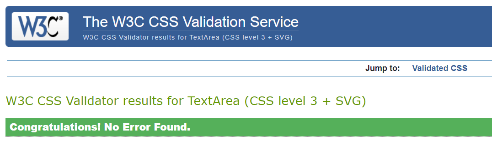

# Testing

Return back to the [README.md](README.md) file.

## Code Validation

### HTML

I have used the recommended [HTML W3C Validator](https://validator.w3.org) to validate all of my HTML files.

| Page | W3C URL | Screenshot | Notes |
| --- | --- | --- | --- |
| home | [W3C Validation](https://validator.w3.org/nu/?doc=https://mlr-shop.herokuapp.com/) |  | Section lacks heading |
| signup | [W3C Validation](https://validator.w3.org/nu/?doc=https://mlr-shop.herokuapp.com/accounts/signup/) |  | Section lacks heading |
| login | [W3C Validation](https://validator.w3.org/nu/?doc=https://mlr-shop.herokuapp.com/accounts/login/) |  | Section lacks heading |
| bag | [W3C Validation](https://validator.w3.org/nu/?doc=https://mlr-shop.herokuapp.com/bag/) |  | Section lacks heading |
| dolls | [W3C Validation](https://validator.w3.org/nu/?doc=https://mlr-shop.herokuapp.com/dolls/) |  | Section lacks heading |
| dolls (by type) | [W3C Validation](https://validator.w3.org/nu/?doc=https://mlr-shop.herokuapp.com/dolls/?dolltype=amaris) |  | Section lacks heading |
| contact | [W3C Validation](https://validator.w3.org/nu/?doc=https://mlr-shop.herokuapp.com/contact/) |  | Section lacks heading |
| newsletter | [W3C Validation](https://validator.w3.org/nu/?doc=https://mlr-shop.herokuapp.com/newsletter/) |  | Section lacks heading |
| password reset | [W3C Validation](https://validator.w3.org/nu/?doc=https://mlr-shop.herokuapp.com/accounts/password/reset/) |  | Section lacks heading. Trailing slash on void elements. |
| doll details | [W3C Validation](https://validator.w3.org/nu/?doc=https://mlr-shop.herokuapp.com/dolls/1) |  | Section lacks heading |

### CSS

I have used the recommended [CSS Jigsaw Validator](https://jigsaw.w3.org/css-validator) to validate all of my CSS files.

| App | File | Jigsaw URL | Screenshot | Notes |
| --- | --- | --- | --- | --- |
| static | [base.css](static/css/base.css) | [Jigsaw Validation](https://jigsaw.w3.org/css-validator/validator?uri=https%3A%2F%2Fmlr-shop.herokuapp.com) |  | 712 warnings from third-party code |
| profiles | [profile.css](profiles/static/profiles/css/profile.css) | N/A |  | |
| checkout | [checkout.css](checkout/static/checkout/css/checkout.css) | N/A |  | 1 warning |

### JavaScript

I have used the recommended [JShint Validator](https://jshint.com) to validate all of my JS files.

| App | File | Screenshot | Notes |
| --- | --- | --- | --- |
| checkout | [stripe_elements.js](checkout/static/checkout/js/stripe_elements.js) |  | Undefined Stripe variable |
| profiles | [countryfield.js](profiles/static/profiles/js/countryfield.js) |  | |

### Python

I have used the recommended [CI Python Linter](https://pep8ci.herokuapp.com) to validate all of my Python files.

| App | File | Validation Link |
| --- | --- | --- |
| bag | | |
| | [bag_tools.py](bag/templatetags/bag_tools.py) | [CI PEP8 Validator](https://pep8ci.herokuapp.com/https://raw.githubusercontent.com/onabz/mlr-shop/main/bag/templatetags/bag_tools.py) |
| | [contexts.py](bag/contexts.py) | [CI PEP8 Validator](https://pep8ci.herokuapp.com/https://raw.githubusercontent.com/onabz/mlr-shop/main/bag/contexts.py) |
| | [urls.py](bag/urls.py) | [CI PEP8 Validator](https://pep8ci.herokuapp.com/https://raw.githubusercontent.com/onabz/mlr-shop/main/bag/urls.py) |
| | [views.py](bag/views.py) | [CI PEP8 Validator](https://pep8ci.herokuapp.com/https://raw.githubusercontent.com/onabz/mlr-shop/main/bag/views.py) |
| checkout |  | |
| | [apps.py](checkout/apps.py) | [CI PEP8 Validator](https://pep8ci.herokuapp.com/https://raw.githubusercontent.com/onabz/mlr-shop/main/checkout/apps.py) |
| | [forms.py](checkout/forms.py) | [CI PEP8 Validator](https://pep8ci.herokuapp.com/https://raw.githubusercontent.com/onabz/mlr-shop/main/checkout/forms.py) |
| | [models.py](checkout/models.py) | [CI PEP8 Validator](https://pep8ci.herokuapp.com/https://raw.githubusercontent.com/onabz/mlr-shop/main/checkout/models.py) |
| | [signals.py](checkout/signals.py) | [CI PEP8 Validator](https://pep8ci.herokuapp.com/https://raw.githubusercontent.com/onabz/mlr-shop/main/checkout/signals.py) |
| | [urls.py](checkout/urls.py) | [CI PEP8 Validator](https://pep8ci.herokuapp.com/https://raw.githubusercontent.com/onabz/mlr-shop/main/checkout/urls.py) |
| | [views.py](checkout/views.py) | [CI PEP8 Validator](https://pep8ci.herokuapp.com/https://raw.githubusercontent.com/onabz/mlr-shop/main/checkout/views.py) |
| | [webhook_handler.py](checkout/webhook_handler.py) | [CI PEP8 Validator](https://pep8ci.herokuapp.com/https://raw.githubusercontent.com/onabz/mlr-shop/main/checkout/webhook_handler.py) |
| | [webhooks.py](checkout/webhooks.py) | [CI PEP8 Validator](https://pep8ci.herokuapp.com/https://raw.githubusercontent.com/onabz/mlr-shop/main/checkout/webhooks.py) |
| contact | | |
| | [admin.py](contact/admin.py) | [CI PEP8 Validator](https://pep8ci.herokuapp.com/https://raw.githubusercontent.com/onabz/mlr-shop/main/contact/admin.py) |
| | [forms.py](contact/forms.py) | [CI PEP8 Validator](https://pep8ci.herokuapp.com/https://raw.githubusercontent.com/onabz/mlr-shop/main/contact/forms.py) |
| | [models.py](contact/models.py) | [CI PEP8 Validator](https://pep8ci.herokuapp.com/https://raw.githubusercontent.com/onabz/mlr-shop/main/contact/models.py) |
| | [urls.py](contact/urls.py) | [CI PEP8 Validator](https://pep8ci.herokuapp.com/https://raw.githubusercontent.com/onabz/mlr-shop/main/contact/urls.py) |
| | [views.py](contact/views.py) | [CI PEP8 Validator](https://pep8ci.herokuapp.com/https://raw.githubusercontent.com/onabz/mlr-shop/main/contact/views.py) |
| dolls | | |
| | [admin.py](dolls/admin.py) | [CI PEP8 Validator](https://pep8ci.herokuapp.com/https://raw.githubusercontent.com/onabz/mlr-shop/main/dolls/admin.py) |
| | [forms.py](dolls/forms.py) | [CI PEP8 Validator](https://pep8ci.herokuapp.com/https://raw.githubusercontent.com/onabz/mlr-shop/main/dolls/forms.py) |
| | [models.py](dolls/models.py) | [CI PEP8 Validator](https://pep8ci.herokuapp.com/https://raw.githubusercontent.com/onabz/mlr-shop/main/dolls/models.py) |
| | [urls.py](dolls/urls.py) | [CI PEP8 Validator](https://pep8ci.herokuapp.com/https://raw.githubusercontent.com/onabz/mlr-shop/main/dolls/urls.py) |
| | [views.py](dolls/views.py) | [CI PEP8 Validator](https://pep8ci.herokuapp.com/https://raw.githubusercontent.com/onabz/mlr-shop/main/dolls/views.py) |
| home | | |
| | [models.py](home/models.py) | [CI PEP8 Validator](https://pep8ci.herokuapp.com/https://raw.githubusercontent.com/onabz/mlr-shop/main/home/models.py) |
| | [urls.py](home/urls.py) | [CI PEP8 Validator](https://pep8ci.herokuapp.com/https://raw.githubusercontent.com/onabz/mlr-shop/main/home/urls.py) |
| | [views.py](home/views.py) | [CI PEP8 Validator](https://pep8ci.herokuapp.com/https://raw.githubusercontent.com/onabz/mlr-shop/main/home/views.py) |
| mlr_shop | | |
| | [settings.py](mlr_shop/settings.py) | [CI PEP8 Validator](https://pep8ci.herokuapp.com/https://raw.githubusercontent.com/onabz/mlr-shop/main/mlr_shop/settings.py) |
| | [urls.py](mlr_shop/urls.py) | [CI PEP8 Validator](https://pep8ci.herokuapp.com/https://raw.githubusercontent.com/onabz/mlr-shop/main/mlr_shop/urls.py) |
| | [views.py](mlr_shop/views.py) | [CI PEP8 Validator](https://pep8ci.herokuapp.com/https://raw.githubusercontent.com/onabz/mlr-shop/main/mlr_shop/views.py) |
| newsletter | | |
| | [admin.py](newsletter/admin.py) | [CI PEP8 Validator](https://pep8ci.herokuapp.com/https://raw.githubusercontent.com/onabz/mlr-shop/main/newsletter/admin.py) |
| | [forms.py](newsletter/forms.py) | [CI PEP8 Validator](https://pep8ci.herokuapp.com/https://raw.githubusercontent.com/onabz/mlr-shop/main/newsletter/forms.py) |
| | [models.py](newsletter/models.py) | [CI PEP8 Validator](https://pep8ci.herokuapp.com/https://raw.githubusercontent.com/onabz/mlr-shop/main/newsletter/models.py) |
| | [urls.py](newsletter/urls.py) | [CI PEP8 Validator](https://pep8ci.herokuapp.com/https://raw.githubusercontent.com/onabz/mlr-shop/main/newsletter/urls.py) |
| | [views.py](newsletter/views.py) | [CI PEP8 Validator](https://pep8ci.herokuapp.com/https://raw.githubusercontent.com/onabz/mlr-shop/main/newsletter/views.py) |
| profiles | | |
| | [forms.py](profiles/forms.py) | [CI PEP8 Validator](https://pep8ci.herokuapp.com/https://raw.githubusercontent.com/onabz/mlr-shop/main/profiles/forms.py) |
| | [models.py](profiles/models.py) | [CI PEP8 Validator](https://pep8ci.herokuapp.com/https://raw.githubusercontent.com/onabz/mlr-shop/main/profiles/models.py) |
| | [urls.py](profiles/urls.py) | [CI PEP8 Validator](https://pep8ci.herokuapp.com/https://raw.githubusercontent.com/onabz/mlr-shop/main/profiles/urls.py) |
| | [views.py](profiles/views.py) | [CI PEP8 Validator](https://pep8ci.herokuapp.com/https://raw.githubusercontent.com/onabz/mlr-shop/main/profiles/views.py) |

## Browser Compatibility

I've tested my deployed project on multiple browsers to check for compatibility issues.

| Browser | Screenshot | Notes |
| --- | --- | --- |
| Chrome |  | Works as expected |
| Firefox |  | Works as expected |
| Edge |  | Works as expected |
| Avg |  | Works as expected |
| Brave |  | Works as expected |
| Opera |  | Works as expected |

## Responsiveness

I've tested my deployed project on multiple devices to check for responsiveness issues.

| Device | Screenshot | Notes |
| --- | --- | --- |
| Mobile (DevTools) |  | Works as expected |
| Tablet (DevTools) |  | Works as expected |
| Laptop (DevTools) |  | Works as expected |
| Desktop |  | Works as expected |
| XL Monitor |  | Works as expected  |
| Samsung S8 Plus |  | Works as expected  |
| Samsung Note 20 |  | Works as expected |
| Samsung S21 Ultra |  | Works as expected |

## Lighthouse Audit

I've tested my deployed project using the Lighthouse Audit tool to check for any major issues.

| Page | Size | Screenshot | Notes |
| --- | --- | --- | --- |
| Home | Mobile |  | Chrome extensions negatively affected this page's load performance |
| Home | Desktop |  | Few warnings |
| Signup | Mobile |  | Chrome extensions negatively affected this page's load |
| Signup | Desktop |  | Few warnings |
| Login | Mobile |  | Chrome extensions negatively affected this page's load performance |
| | Login | Desktop |  | Few warnings |
 | Bag | Mobile |  | Chrome extensions negatively affected this page's load performance |
| Bag | Desktop |  | Few warnings |
| Dolls | Mobile |  | Chrome extensions negatively affected this page's load performance |
| Dolls | Desktop |  | Few warnings |
| Dolls(by type) | Mobile |  | Chrome extensions negatively affected this page's load performance |
| Dolls(by type) | Desktop |  | Few warnings |
| Contact | Mobile |  | Chrome extensions negatively affected this page's load performance |
| Contact | Desktop |  | Few warnings |
| Newsletter | Mobile |  | Chrome extensions negatively affected this page's load performance |
| Newsletter | Desktop |  | Few warnings |
| Doll Details | Mobile |  | Chrome extensions negatively affected this page's load performance/sizes |
| Doll Details | Desktop |  | Few warnings |

## Defensive Programming

Defensive programming (defensive design) is extremely important!

When building projects that accept user inputs or forms, you should always test the level of security for each.
Examples of this could include (not limited to):

Forms:
- Users cannot submit an empty form
- Users must enter valid email addresses

PP3 (Python-only):
- Users must enter a valid letter/word/string when prompted
- Users must choose from a specific list only

Flask/Django:
- Users cannot brute-force a URL to navigate to a restricted page
- Users cannot perform CRUD functionality while logged-out
- User-A should not be able to manipulate data belonging to User-B, or vice versa
- Non-Authenticated users should not be able to access pages that require authentication
- Standard users should not be able to access pages intended for superusers

You'll want to test all functionality on your application, whether it's a standard form,
or uses CRUD functionality for data manipulation on a database.
Make sure to include the `required` attribute on any form-fields that should be mandatory.
Try to access various pages on your site as different user types (User-A, User-B, guest user, admin, superuser).

You should include any manual tests performed, and the expected results/outcome.

Defensive programming was manually tested with the below user acceptance testing:

| Page | User Action | Expected Result | Pass/Fail | Comments |
| --- | --- | --- | --- | --- |
| Home Page | | | | |
| | Click on Logo | Redirection to Home page | Pass | |
| | Click on Home link in navbar | Redirection to Home page | Pass | |
| Gallery Page | | | | |
| | Click on Gallery link in navbar | Redirection to Gallery page | Pass | |
| | Load gallery images | All images load as expected | Pass | |
| Contact Page | | | | |
| | Click on Contact link in navbar | Redirection to Contact page | Pass | |
| | Enter first/last name | Field will accept freeform text | Pass | |
| | Enter valid email address | Field will only accept email address format | Pass | |
| | Enter message in textarea | Field will accept freeform text | Pass | |
| | Click the Submit button | Redirects user to form-dump | Pass | User must click 'Back' button to return |
| Sign Up | | | | |
| | Click on Sign Up button | Redirection to Sign Up page | Pass | |
| | Enter valid email address | Field will only accept email address format | Pass | |
| | Enter valid password (twice) | Field will only accept password format | Pass | |
| | Click on Sign Up button | Asks user to confirm email page | Pass | Email sent to user |
| | Confirm email | Redirects user to blank Sign In page | Pass | |
| Log In | | | | |
| | Click on the Login link | Redirection to Login page | Pass | |
| | Enter valid email address | Field will only accept email address format | Pass | |
| | Enter valid password | Field will only accept password format | Pass | |
| | Click Login button | Redirects user to home page | Pass | |
| Log Out | | | | |
| | Click Logout button | Redirects user to logout page | Pass | Confirms logout first |
| | Click Confirm Logout button | Redirects user to home page | Pass | |
| Profile | | | | |
| | Click on Profile button | User will be redirected to the Profile page | Pass | |
| | Click on the Edit button | User will be redirected to the edit profile page | Pass | |
| | Click on the My Orders link | User will be redirected to the My Orders page | Pass | |
| | Brute forcing the URL to get to another user's profile | User should be given an error | Pass | Redirects user back to own profile |

Repeat for all other tests, as applicable to your own site.
The aforementioned tests are just an example of a few different project scenarios.

## User Story Testing

Testing user stories is actually quite simple, once you've already got the stories defined on your README.

Most of your project's **features** should already align with the **user stories**,
so this should as simple as creating a table with the user story, matching with the re-used screenshot
from the respective feature.

| User Story | Screenshot |
| --- | --- |
| As a new site user, I would like to ____________, so that I can ____________. |  |
| As a new site user, I would like to ____________, so that I can ____________. |  |
| As a new site user, I would like to ____________, so that I can ____________. |  |
| As a returning site user, I would like to ____________, so that I can ____________. |  |
| As a returning site user, I would like to ____________, so that I can ____________. |  |
| As a returning site user, I would like to ____________, so that I can ____________. |  |
| As a site administrator, I should be able to ____________, so that I can ____________. |  |
| As a site administrator, I should be able to ____________, so that I can ____________. |  |
| As a site administrator, I should be able to ____________, so that I can ____________. |  |
| repeat for all remaining user stories | x |

## Bugs

### **Fixed Bugs**

- HTML Validation error on dolls detail page. This is from Summernote widget, and cannot be fixed from my side.

    - To fix this, I removed Summernote entirely.

    

## Unfixed Bugs

There are no remaining bugs that I am aware of.
